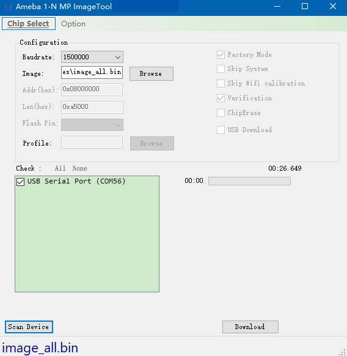
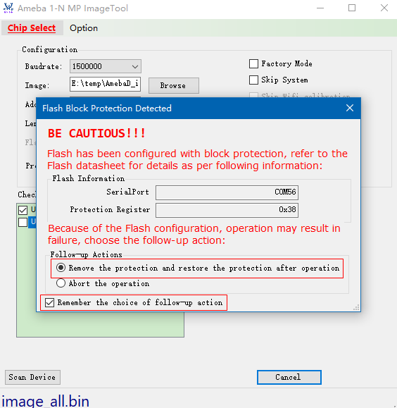
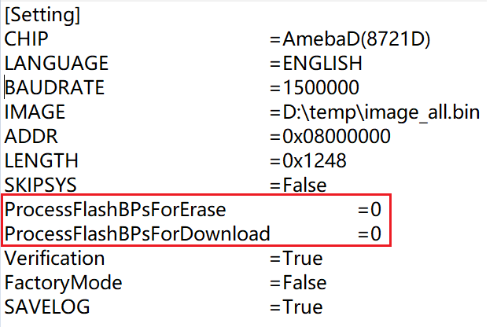

.. _1_n_mp_tool:

Introduction
==================================

This document introduces how to use Ameba 1-N MP ImageTool to download images for several boards simultaneously.

.. figure:: ../figures/ameba_1_n_mp_imagetool.png
   :scale: 90%
   :align: center

   Ameba 1-N MP ImageTool UI

The tool will first download the flashloader code into SRAM, then the flashloader will handle the subsequent image download to Ameba Flash.

.. _1_n_mp_tool_environment_setup:

Environment Setup
==================================
Hardware Setup
----------------------------
To download images for several boards simultaneously, the equipments listed below are necessary.

- DUT (Ameba device with :guilabel:`LOGUART` interface and :guilabel:`UART_DOWNLOAD` button)

- USB hub & micro USB cable

- PC with 1-N MP ImageTool installed

.. figure:: ../figures/hardware_setup.png
   :scale: 120%
   :align: center

   Hardware setup

.. note::

   If using external UART to download images, USB to UART dongle must be used.

Software Setup
----------------------------
- Environment requirements: EX. Winows XP, Winows 7 higher, Microsoft .NET Framework 3.5

- Software location:

   - :file:`Ameba_1-N_MP_ImageTool.exe`: ``{SDK}/tools/ameba/MP_ImageTool_1_N/Ameba_1-N_MP_ImageTool.exe``

   - :file:`DeviceProfiles`: ``{SDK}/tools/ameba/DeviceProfiles``

.. note::

      - To download images through UART interface, the host driver for USB to UART adapter (e.g. PL2303GC) on the board shall be installed first, please find the exact driver from the official website of corresponding vendor of the USB to UART adapter.

      - Do not modify or delete :file:`floader_amebaxxx.bin` files, because they are flashloader binary files.

.. only:: RTL8730E or RTL8721D or RTL8711D
   
   .. note::

      For WinXP or Win7 only, install the following USB driver if there is a need to download images through USB interface: ``{SDK}/tools/ameba/MP_ImageTool_1_N/RtkUsbCdcAcmSetup.INF``.
   

.. _1_n_mp_tool_image_download:

Image Download
============================
This tool can work in Windows Form Mode and Command Line Mode. The following sections introduce each mode.

Before image download, DUT must enter **UART_DOWNLOAD** mode. The method is:

1. Connect ``LOGUART Tx`` pin to GND. If :guilabel:`UART_DOWNLOAD` button exists, push it down and keep it pressed.

2. Power on the board again, or press the :guilabel:`Reset` button.

3. Connect the ``LOGUART Tx`` pin back, or release the :guilabel:`UART_DOWNLOAD` button.

Now, DUT gets into **UART_DOWNLOAD**  mode, and you can use this tool to download images.

GUI Mode
----------------

Download Flow
~~~~~~~~~~~~~~~~~~~~~~~~~~
The steps to download images in normal mode are as follows:

1. Double click :file:`Ameba_1-N_MP_ImageTool.exe`.

2. Click :menuselection:`Chip Select` to select DUT type.

3. Set the Configuration

   :Baudrate: Select the baudrate for image download, default value is 1500000.

   :Image: Click :guilabel:`Browse` button to choose the target image file.

   :Addr(hex): Input the destination address to download.

   :Leg(hex): Input image length to download, and it will fill when selected target image file.

.. note::
   Once the chip is selected, some button/checkbox is gray and unable to be accessed, it means that the function is not supported for the selected IC.

4. Click :guilabel:`Scan Device` button, the detected devices are listed in the box.

   - If :guilabel:`USB Download` is checked, the devices detected and shown in the box are ``USB COMs``.

   - If :guilabel:`USB Download` is not checked, the devices detected and shown in the box are ``LOGUART COMs``.

.. note::
   If some devices are not present immediately, check if the driver is still installing and wait until the installation is finished. This situation is usually encountered when DUT is plugged into PC the first time.

5. Tick in the checkbox to select the target devices.

6. Get the DUTs into **UART_DOWNLOAD** mode.

7. Click :guilabel:`Download` button.

.. figure:: ../figures/ameba_1_n_mp_imagetool_operation.png
   :scale: 90%
   :align: center

   Ameba 1-N MP ImageTool operation

Once click :guilabel:`Download` button, image download starts.

- If the image download is in process, as the following figures show, a light bulb shows up at the end of each progress bar, and a stopwatch measures the elapsed time. When image download is finished, a green tick shows up.

  .. figure:: ../figures/image_download_ok_1.png
     :scale: 90%
     :align: center
  
  .. figure:: ../figures/image_download_ok_2.png
     :scale: 90%
     :align: center

     Image download is ok
  

- If some typical troubleshootings occur, refer to Section :ref:`Troubleshooting` for help.

Optional Functions
~~~~~~~~~~~~~~~~~~~~~~~~~~~~~~~~~~~~
Factory Mode
^^^^^^^^^^^^^^^^^^^^^^^^
If Factory Mode is enabled, the UI disables some functions. The configuration parameters are saved to :file:`Setting.ini` and reloaded when the tool restarts the next time.

   Factory Mode

There are two ways to exit the factory mode:

1. Close the tool.

   a. Delete :file:`Setting.ini`.

   b. Edit :file:`Setting.ini` and modify ``FactoryMode`` parameter value to **False**.

2. Open the tool again, and the modified parameters will be restored to normal mode.

.. figure:: ../figures/parameters_modification.png
   :scale: 70%
   :align: center

   Parameters modification

Verification
^^^^^^^^^^^^^^^^^^^^^^^^
This option means whether to examine the checksum after download finished.

- Instruction: Select checkbox Verification in step 3 in :ref:`download_flow`.

ChipErase
^^^^^^^^^^^^^^^^^^
This option means whether to erase chip before download.

- Instruction: Select checkbox ChipErase in step 3 in :ref:`download_flow`.

Skip System
^^^^^^^^^^^^^^^^^^^^^^
This option means whether to skip system data area or not when downloading image.

- Instruction: Select checkbox Skip System in step 3 in :ref:`download_flow`.

USB Download
^^^^^^^^^^^^^^^^^^^^^^^^
This option means whether to download image through USB for NAND flash.

- Instruction Select checkbox USB Download in step 3 in :ref:`download_flow`.

If this option is selected, click :guilabel:`Profile Browse` button to choose the target profile file.

Skip Wi-Fi Calibration
^^^^^^^^^^^^^^^^^^^^^^^^^^^^^^^^^^^^^^^^^^^^
This option means whether to skip Wi-Fi calibration when downloading images.

- Instruction: Select checkbox Skip Wifi calibration in step 3 in :ref:`download_flow`.

Support for >16MB Flash Download
^^^^^^^^^^^^^^^^^^^^^^^^^^^^^^^^^^^^^^^^^^^^^^^^^^^^^^^^^^^^^^^^
This option means whether support for >16MB Flash download. This function will help users program OTP bit to enable 4-byte mode to access the Flash.

- Instruction: Select Option -> Support for >16MB Flash Download in step 3 in :ref:`download_flow`.

Remember Flash Protection Process for Erase/Download
^^^^^^^^^^^^^^^^^^^^^^^^^^^^^^^^^^^^^^^^^^^^^^^^^^^^^^^^^^^^^^^^^^^^^^^^^^^^^^^^^^^^^^^^^^^^^^^^^^^^^^^^
When downloading images, it may occurred that the flash protection bit is programmed for protect flash areas, user can select this option function to clear flash protection bit to erase/program flash, and after that finished, tool will revert flash protection bit to origin as they are.

- Instruction: Select Option -> Remember Flash Protection process for erase/download in step 3 in :ref:`download_flow`.

Command Line Mode
----------------------------------

.. _download_flow:

Download Flow
~~~~~~~~~~~~~~~~~~~~~~~~~~
This tool can also work in command line mode. Start :file:`cmd.exe` in Windows and execute :file:`Ameba_1-N_MP_ImageTool.exe` with defined parameters, and the command line mode supports multi-parameters input with one command after v2.5.11.

The steps to download images in command line mode are as follows:

1. Select chip type

2. Set the configuration

   a. Set the chip type

      Use ``-c/--chip [amebaz|amebad|amebaz2|amebasmart|amebalite|amebadplus]`` as parameters for target chip set.

      .. code::

         $Ameba_1-N_MP_ImageTool.exe -c amebaxxx
         CHIP:            AMEBAXXX

   b. Set the baudrate

      Use ``-b/--baudrate <value>`` as parameters.

      .. code::
    
         $Ameba_1-N_MP_ImageTool.exe -b 1500000
         BAUDRATE:            1500000

      .. note::
         The value of baudrate only can be set as 115200, 128000, 153600, 230400, 380400, 460800, 500000, 921600, 1000000, 1382400, 1444400, and 1500000.

   c. Set target image path

      Use ``-i/--image <image_path>`` as parameters.

      .. code::

         $Ameba_1-N_MP_ImageTool.exe -i E:\test\image_path\image_all.bin
         FILE PATH:            e:\test\image_path\image_all.bin

   d. Set download start address

      Use ``-a/--address <value>`` as parameters.

      .. code::

         $Ameba_1-N_MP_ImageTool.exe -a 0x08000000
         ADDRESS:            0x08000000

   e. Set image length

      Use ``-l/--length <value>`` as parameters.

      .. code::

         $Ameba_1-N_MP_ImageTool.exe -l 0xa500
         LENGTH:  0XA500

3. Double check settings to download

   Use ``--show setting`` as parameters to check the tool configuration.

   .. code::

      $Ameba_1-N_MP_ImageTool.exe --show setting
      CHIP:            AMEBAZ
      BAUDRATE:       1500000
      IMAGE:           e:\test\image_path\image_all.bin
      ADDRESS:        0x08000000
      SKIP SYSTEM:     False
      LENGTH:          0x0
      ProcessFlashBPsForErase:    0
      ProcessFlashBPsForDownload:    0
      VERIFICATION:    True
      SAVELOG:         True

   .. note::
      The configurations need to be done only once before mass production (MP). These parameters would be saved into Setting.ini. When MP starts, the factory can download directly.

4. Download images

   After configuration is finished, use ``-d/--download <dev1>`` or ``-d/--download added`` to download images for devices.

   - ``-d/--download added`` is used to download images for all devices specified by ``--add device`` commands.

      .. code::

         $Ameba_1-N_MP_ImageTool.exe -d added

   - ``-d/--download <dev1>`` is used to download images for a specified device without modifying the device list.

      .. code::

         $Ameba_1-N_MP_ImageTool.exe -d COM4 COM5
         1  COM4 SUCCESS
         2  COM5 SUCCESS

      .. note::
         After v2.5.11, the command line mode supports multi-parameters input when download starts.

      .. code::

         $Ameba_1-N_MP_ImageTool.exe -c amebad -b 1500000 -a 0x08000000 -l 0xa500 -i e:\test\image_path\image_all.bin -s true -d COM4 COM5
         1  COM4 SUCCESS
         2  COM5 SUCCESS

If the print message shows that the download procedure is failed, check the log file located at /log to get the fail reason.

Optional Functions
~~~~~~~~~~~~~~~~~~~~~~~~~~~~~~~~~~~~
USB Download
^^^^^^^^^^^^^^^^^^^^^^^^
USB download is supported for NAND Flash image download. Set this option function in step 2 in :ref:`download_flow`.

To select whether to use USB download or not, use ``-u/--usbdownload [true|false]`` as parameters.

   .. code::

      $Ameba_1-N_MP_ImageTool.exe –u true
      USBDOWNLOAD:    True

If USB download is selected, the profile should be set well, use ``-p/--profile <path>`` as parameters.

   .. code::

      $Ameba_1-N_MP_ImageTool.exe –p E:\MP_Image_Tool\image_all.rdev
      PROFILE:  e:\mp_image_Tool\image_all.rdev

Scan Device
^^^^^^^^^^^^^^^^^^^^^^
Use ``--scan device`` as parameters to check serial ports connected to PC.

   .. code::

      $Ameba_1-N_MP_ImageTool.exe --scan device
      USB Serial Port (COM4)
      USB Serial Port (COM5)

Add/Remove/Show Device
^^^^^^^^^^^^^^^^^^^^^^^^^^^^^^^^^^^^^^^^^^^^
Use ``--add <dev>`` and ``--remove <dev>`` to specify the devices that are needed to download to, and ``--show device`` to list the specified device names.

   .. code::
    
      $Ameba_1-N_MP_ImageTool.exe --add COM4 COM5
      COM4 added!
      COM5 added!
      $Ameba_1-N_MP_ImageTool.exe --show device
      COM4
      COM5
      $Ameba_1-N_MP_ImageTool.exe --remove COM5
      COM5 removed!
      $Ameba_1-N_MP_ImageTool.exe --show device
      COM4

If devices are added, the command to download is specified in step 4 in :ref:`download_flow`.

Verification
^^^^^^^^^^^^^^^^^^^^^^^^
To select whether to examine the checksum after download is finished, use ``-v/--verify [true|false]`` as parameters.

   .. code::

      $Ameba_1-N_MP_ImageTool.exe –v true
      VERIFICATION:  True

This option function should be set in step 2 in :ref:`download_flow`.

Chip Erase
^^^^^^^^^^^^^^^^^^^^
To select whether to erase full chip before download, use ``-e/--chiperase [true|false]`` as parameters.

   .. code::

      $Ameba_1-N_MP_ImageTool.exe –e true
      CHIPERASE:  True

This option function should be set in step 2 in :ref:`download_flow`.

DtrRtsConfig
^^^^^^^^^^^^^^^^^^^^^^^^
If the device supports configuring DtrRts to enter UART download mode automatically, this option will help you. Use ``-g/--dtrrtsconfig [true|false]`` as parameters.

   .. code::

      $Ameba_1-N_MP_ImageTool.exe –g true
      DtrRtsConfig:  True

This option function should be set in step 2 in :ref:`download_flow`.

Remember Flash Protection Process for Erase/Download
^^^^^^^^^^^^^^^^^^^^^^^^^^^^^^^^^^^^^^^^^^^^^^^^^^^^^^^^^^^^^^^^^^^^^^^^^^^^^^^^^^^^^^^^^^^^^^^^^^^^^^^^
To select whether to remember Flash protection process for erase/download after erase/download is finished, use ``-f/--processflashbpsforerase | -n/--processflashbpsfordownload <value>`` as parameters.

   .. code::

      $Ameba_1-N_MP_ImageTool.exe –f 1
      ProcessFlashForErase:  1
      $Ameba_1-N_MP_ImageTool.exe –n 1
      ProcessFlashForDownload:  1

This option function should be set in step 2 in :ref:`download_flow`.

Save Log
^^^^^^^^^^^^^^^^
To select whether to save log or not, use ``-s [true|false]`` as parameters.

   .. code::

      $Ameba_1-N_MP_ImageTool.exe –s true
      SAVELOG:    True

This option function should be set in step 2 in :ref:`download_flow`.

GPIO/PWM Indication
^^^^^^^^^^^^^^^^^^^^^^^^^^^^^^^^^^^^^^
The tool supports downloading image through USB for NAND Flash. Since the device and USB port do not have a unique correspondence, the download failed devices cannot be well identified on the production line. If you need to download image through USB, the GPIO/PWM indication function can be used to indicate which devices have successfully downloaded the images, so as to redo the download processes for the failed devices.

According to the configuration parameters, the tool will send the corresponding query to the device, and the device will output high or low level through GPIO or output PWM through PWM channel.

The configuration methods are shown below:

1. Turn off the running tool first.

2. Open the :file:`Setting.ini` file in the tool directory and configure the ``ProgramConfig`` (default: 0).

   Refer to as following table for bit field description of ``ProgramConfig``.

.. table:: Bit field description of ProgramConfig
   :width: 100%
   :widths: auto
   :class: longtable

   +---------+--------------------------------------------------------------------------------------------+
   | Bit     | Description                                                                                |
   +=========+============================================================================================+
   | [63:32] | Download indication configuration:                                                         |
   |         |                                                                                            |
   |         | - For GPIO indication                                                                      |
   |         |                                                                                            |
   |         |    - Bit[63:33]: Reserved                                                                  |
   |         |                                                                                            |
   |         |    - Bit[32]: GPIO output level                                                            |
   |         |                                                                                            |
   |         | - For PWM indication                                                                       |
   |         |                                                                                            |
   |         |    - Bit[63:57]: PWM duty cycle (0~100, unit: percent)                                     |
   |         |                                                                                            |
   |         |    - Bit[56:32]: PWM period (unit: us)                                                     |
   +---------+--------------------------------------------------------------------------------------------+
   | [31:30] | Download indication strategy:                                                              |
   |         |                                                                                            |
   |         | - 0: Disable                                                                               |
   |         |                                                                                            |
   |         | - 1: GPIO indication after download success                                                |
   |         |                                                                                            |
   |         | - 2: PWM indication after download success                                                 |
   |         |                                                                                            |
   |         | - 3: Reserved                                                                              |
   +---------+--------------------------------------------------------------------------------------------+
   | [29:16] | Download indication PIN name, refer to the SoC-specific definition of PinName for MBED API |
   |         |                                                                                            |
   |         | - GPIO: all GPIO pins can be selected                                                      |
   |         |                                                                                            |
   |         | - PWM: PWM channels can be selected                                                        |
   +---------+--------------------------------------------------------------------------------------------+
   | [15:2]  | Reserved                                                                                   |
   +---------+--------------------------------------------------------------------------------------------+
   | [1:0]   | NAND Flash bit flip fail level:                                                            |
   |         |                                                                                            |
   |         | - 2/3: Reserved                                                                            |
   |         |                                                                                            |
   |         | - 1: Fail at fatal bit flip error, i.e. bit flip count > ECC level                         |
   |         |                                                                                            |
   |         | - 0: Fail at bit flip error, i.e. bit flip count >= ECC level                              |
   +---------+--------------------------------------------------------------------------------------------+

3. Save :file:`Setting.ini` and reopen the tool to download.

Read MAC
^^^^^^^^^^^^^^^^
Read the MAC of the devices through the command ``-r/--readmac``:

   .. code::

      $Ameba_1-N_MP_ImageTool.exe -r COM4
      COM4  FF-FF-FF-FF-FF-FF

Combine Images
^^^^^^^^^^^^^^^^^^^^^^^^^^^^
Use ``--combine "<image1_path>;<image2_path>" --offset "<image1_offset><image2_offset>" [--output "<image_all_output>"]`` to combine the images together.

   .. code::

      $Ameba_1-N_MP_ImageTool.exe --combine "E:\image1.bin;E:\image2.bin" --offset "0x00000000;0x00004000" --output E:\image_all.bin
      Offset0: 0x00000000, Image0: E:\image1.bin
      Offset1: 0x00004000, Image1: E:\image2.bin
      Images have been combined successfully, size: 12KB, path: E:\image_all.bin

Erase
^^^^^^^^^^
Use ``--erase <address> <value> [length] <value>(KB) <dev1> <dev2>`` to erase the Flash in CLI mode.

   .. code::

      $Ameba_1-N_MP_ImageTool.exe --erase 0x08000000 1024 COM56
      Flash erase done!

.. note::
   Before erasing the Flash, you should set up the device, such as setting the images, the baudrate, and so on.

CLI Help
^^^^^^^^^^^^^^^^
The supported parameters can be achieved by typing ``--help``.

   .. code::

      $Ameba_1-N_MP_ImageTool.exe --help
      Ameba 1-N MP ImageTool 2.5.13.0
      Copyright ?  2016
      -a ADDRESS, --address=ADDRESS                         Set start download address
      -b BAUDRATE, --baudrate=BAUDRATE                     Set download baudrate
      -c CHIP, --chip=CHIP                                    Set target chip
      -d [COMx COMy COMn|added], --download=[COMx COMy COMn|added]  Target device to download
      -e TRUE|FASLE, --chiperase=TRUE|FASLE               Erase chip or not before download
      -f PROCESSFLASHBPSFORERASE, --processflashbpsforerase=PROCESSFLASHBPSFORERASE  Process flash BPs for erase or not when download
      -g TRUE|FASLE, --dtrrtsconfig=TRUE|FASLE            Set Dtr/Rts config or not
      -h FLASHPIN, --flashpin=FLASHPIN                      Set flashpin for download
      -i IMAGE, --image=IMAGE                                 Set target image path
      -k TRUE|FASLE, --skipsys=TRUE|FASLE                  Skipsys or not when download
      -l LENGTH, --length=LENGTH                             Set target image length
      -m TRUE|FASLE, --support4bytesaddrmode=TRUE|FASLE          Support 4-byte address mode or not when download
      -n PROCESSFLASHBPSFORDOWNLOAD, --processflashbpsfordownload=PROCESSFLASHBPSFORDOWNLO AD      Process flash BPs for download or not when download
      -p PROFILE, --profile=PROFILE               Set target device profile path for download
      -r [COMx COMy COMn|added], --readmac=[COMx COMy COMn|added]  Target device to read mac
      -s TRUE|FASLE, --savelog=TRUE|FASLE                         Save log or not when download
      -t CheckFlashAddrModeTimeoutSecond, --checkflashaddrmodetimeoutsecond=CheckFlashAddr ModeTimeoutSecond     Timeout(unit:s) used to pop confirm window for check flash address mode
      -u TRUE|FASLE, --usbdownload=TRUE|FASLE       Select usb download or not
      -v TRUE|FASLE, --verify=TRUE|FASLE         Set verification or not when download
      -w TRUE|FASLE, --skipwifi=TRUE|FASLE       Skip wifi for AmebaZ2
      --add=COMx COMy COMn                          Add target device
      --remove=COMx                                  Remove target device
      --combine=IMAGE1;IMAGE2;IMAGEx             Combine images together
      --offset=OFFSET1;OFFSET2;OFFSET3           Images' offset to combine
      --output=OUTPUT                                Combined images output path
      --erase=addr length COMx COMy COMn         Erase target device at addr with length(KB)
      --show=setting|device                         Show setting or device
      --scan=device                                  Scan devices
      --help                                           Display this help screen
      --version                                       Display version information

Common Config
--------------------------
You can change the configuration in :file:`Setting.ini`.

.. note::
   Close the tool first before changing the configuration below.

Show Detail Log
~~~~~~~~~~~~~~~~~~~~~~~~~~~~~~
This option aims to show the detailed logs for users. You can change the configuration in :file:`Setting.ini` to select whether to show the detailed logs or not.

   .. code::

      ShowDetailLog           =True

This option function should be set in step 2 in :ref:`download_flow`.

Download Progress Display
~~~~~~~~~~~~~~~~~~~~~~~~~~~~~~~~~~~~~~~~~~~~~~~~~~
You can set the configuration in :file:`Setting.ini` to select whether to show progress Bar in console when downloading in CLI mode.

   .. code::

      DownloadProgressDisplay           =True

This option function should be set in step 2 in :ref:`download_flow`.

Download image to sram
~~~~~~~~~~~~~~~~~~~~~~~~~~~~~~~~~~~~~~~~~~~~
After v2.5.24, Ameba 1-N MP ImageTool supports to download to sram with mp shrink image. The system will reboot automatically after download successfully and it can response to command through serial port without hard reboot.

And the mp image layout in sram is:

.. table:: MP Shrink Image Layout in Sram
   :width: 100%
   :widths: auto

   +------------+------------------+--------------+------------+
   | IC         | ImageType        | StartAddress | EndAddress |
   +============+==================+==============+============+
   | AmebaDplus | km4_boot_all.bin | 0x20012000   | 0x2001A000 |
   +------------+------------------+--------------+------------+
   | AmebaDplus | km0_km4_app.bin  | 0x2001A000   | 0x20080000 |
   +------------+------------------+--------------+------------+
   | AmebaLite  | km4_boot_all.bin | 0x20012000   | 0x2001A000 |
   +------------+------------------+--------------+------------+
   | AmebaLite  | kr4_km4_app.bin  | 0x2001A000   | 0x20080000 |
   +------------+------------------+--------------+------------+

.. figure:: ../figures/mp_shrink_image_address_setting.png
   :scale: 90%
   :align: center

   MP Shrink Image Address Setting

.. note::
   Note: This function only supports AmebaLite and AmebaDplus.

.. _troubleshooting:

Troubleshooting
==============================
Download Fail
--------------------------
If image download is failed, enter the ``UART_DOWNLOAD`` mode to try again.

When transmission interrupts or verification fails, a red error sign shows up, you need to check the error log and try again. There are two ways to get the error messages:

- Hover the mouse cursor over the sign, the error message shows up, as following figure shows.

.. figure:: ../figures/download_is_fail.png
   :scale: 90%
   :align: center

   Download is fail

- Check the log file which locates at ``/log/`` to get more detailed error messages.

   .. code::

      Start Tool from UI
      Scan Device Start
      Scan Device End
      Start to Download...
      COM56 Open COM error

.. note::
   Enable save log function first before download starts.

Flash Write Protected
------------------------------------------
If Flash is write protected by Flash BPs, that is to say, when Flash block protection is detected during image download or Flash erase, a pop up dialog will guide user to choose the follow-up actions.

- You can process Flash BPs for download as needed, as following figure shows.

   Flash block protection detected

- Or set ``ProcessFlashBPsForErase`` and ``ProcessFlashBPsForDownload`` to process Flash block protection bits in :file:`Setting.ini` to avoid download blocked error.

The values of ``ProcessFlashBPsForErase`` and ``ProcessFlashBPsForDownload`` are:

   - 0: When detect Flash block protection, tool pops new window to ask the customer what to do next when erase/download.

   - 1: Tool will remove the Flash protection and restore the Flash protection when erase/download.

   - 2: Tool will abort erase/download when detect Flash block protection.

   Setting.ini

Power-off Accident
------------------------------------
If accidents happen when transmission is in progress such as DUT powers off by accident, which cause the download failed, try to enter the **UART_DOWNLOAD** mode and download again.

