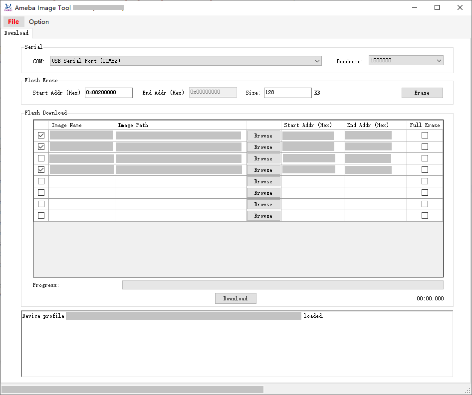

.. _image_tool:

Introduction
------------------------
The Image Tool is the official image download tool developed by Realtek for Ameba series SoC.
It can be used to download images to the Flash of the device through the interfaces below.
   
   
.. table:: Download interface supported by different Ameba ICs
   :width: 100%
   :widths: auto

   +------------+------------+-------------------------+------------------------+
   | Ameba IC   | Flash type | UART download interface | USB download interface |
   +============+============+=========================+========================+
   | AmebaSmart | NOR Flash  | √                       | √                      |
   |            +------------+-------------------------+------------------------+
   |            | NAND Flash | ×                       | √                      |
   +------------+------------+-------------------------+------------------------+
   | AmebaDPlus | NAND Flash | ×                       | √                      |
   +------------+------------+-------------------------+------------------------+
   | AmebaLite  | NAND Flash | ×                       | √                      |
   +------------+------------+-------------------------+------------------------+

The UI of Image Tool is shown below.

   Image Tool UI

Environment Setup
----------------------------------
Hardware Setup
~~~~~~~~~~~~~~~~~~~~~~~~~~~~
The hardware setup for image download is shown below.

.. tabs::

   .. tab:: AmebaSmart

      .. figure:: ../figures/hardware_setup_for_image_download_smart.svg
         :scale: 130%
         :align: center

         Hardware setup for image download

   .. tab:: AmebaLite

      .. figure:: ../figures/hardware_setup_for_image_download_lite.svg
         :scale: 130%
         :align: center

         Hardware setup for image download

   .. tab:: AmebaDPlus

      .. figure:: ../figures/hardware_setup_for_image_download_dplus.svg
         :scale: 130%
         :align: center

         Hardware setup for image download
   

Software Setup
~~~~~~~~~~~~~~~~~~~~~~~~~~~~
- Environment Requirements: EX. WinXP, Win 7 or later, Microsoft .NET Framework 4.0.

- Software location:

   - Image Tool: ``{SDK}/tools/ameba/ImageTool/AmebaImageTool.exe``

   - Device Profile Editor: ``{SDK}/tools/ameba/DeviceProfileEditor/AmebaDeviceProfileEditor.exe``

   - Device profiles: ``{SDK}/tools/ameba/DeviceProfiles``

     Device profiles provide the necessary device information required for image download, with the naming rules:

     .. code-block::
      
        <SoC name>_<OS type>_<Flash type>[_<Extra info>].rdev

     Where:

      :SoC name: the name of Realtek Ameba SoC

      :OS type: FreeRTOS or Linux

      :Flash type: NOR or NAND

      :Extra info: extra information like Flash size, application, etc.

.. note::
      - ``{ImageTool}`` will be used for short of ``{SDK}/tools/ameba/ImageTool`` in the following sections.

      - To download images through UART interface, the host driver for USB to UART adapter (e.g. PL2303GC) on the board shall be installed first, please find the exact driver from the official website of corresponding vendor of the USB to UART adapter.

      - For WinXP or Win7 only, install the USB driver :file:`{ImageTool}/RtkUsbCdcAcmSetup.INF` if there is a need to download images through USB interface.
      
Image Download
-----------------
Download Images
~~~~~~~~~~~~~~~~
For an empty chip, the following mandatory images shall be downloaded:

.. table::
   :width: 100%
   :widths: auto
   
   +---------------------------+----------------------+---------------------------+---------------------------------------+
   | IC                        | Image name           | Description               | Mandatory?                            |
   +===========================+======================+===========================+=======================================+
   | AmebaSmart                | km4_boot_all.bin     | KM4 bootloader            | √                                     |
   |                           +----------------------+---------------------------+---------------------------------------+
   |                           | km0_km4_ca32_app.bin | KM0/KM4/CA32 applications | √                                     |
   +---------------------------+----------------------+---------------------------+---------------------------------------+
   | AmebaLite                 | km4_boot_all.bin     | KM4 bootloader            | √                                     |
   |                           +----------------------+---------------------------+---------------------------------------+
   |                           | kr4_km4_app.bin      | KR4/KM4 applications      | √                                     |
   |                           +----------------------+---------------------------+---------------------------------------+
   |                           | dsp_all.bin          | DSP image                 | x (only for IC series with DSP)       |
   +---------------------------+----------------------+---------------------------+---------------------------------------+
   | AmebaDPlus                | km4_boot_all.bin     | KM4 bootloader            | √                                     |
   |                           +----------------------+---------------------------+---------------------------------------+
   |                           | km0_km4_app.bin      | KM0/KM4 applications      | √                                     |  
   +---------------------------+----------------------+---------------------------+---------------------------------------+

Download Steps
~~~~~~~~~~~~~~~~
The image download steps are illustrated below:
   
1. Enter into download mode.

   There are two ways to enter into download mode.
      
      A. The first and recommended way is to push the hardware :guilabel:`Download` and :guilabel:`CHIP_EN` buttons.
      
         a. Push the :guilabel:`Download` button and keep it pressed.
      
         b. Re-power on the device or press the :guilabel:`CHIP_EN` button.
      
         c. Release the :guilabel:`Download` button.
      
      B. The alternate way is to type the ``reboot uartburn`` command from the UART console if this command is not removed from SDK and AP is running normally.
   
   Now, the device goes into download mode and is ready to receive data.
   
.. tabs::

   .. tab:: AmebaSmart

      2. Open Image Tool, click :menuselection:`File > Open` and select the proper device profile.
      
         - For IC series with NOR Flash, select :file:`AmebaSmart_FreeRTOS_NOR.rdev`.
      
         - For IC series with NAND Flash, select :file:`AmebaSmart_FreeRTOS_NAND.rdev`.         
   
   .. tab:: AmebaLite

      2. Open Image Tool, click :menuselection:`File > Open` and select the device profile :file:`AmebaLite_FreeRTOS_NOR.rdev`.

   .. tab:: AmebaDPlus

      2. Open Image Tool, click :menuselection:`File > Open` and select the device profile :file:`AmebaDplus_FreeRTOS_NOR.rdev`.

   
3. Select the corresponding serial port and transmission baud rate. The default baud rate is 1500000.
      
.. note:: The baud rate will be ignored for USB download interface.
         
   4. Click the :menuselection:`Browse` button to select the images to be programmed.
   
      .. note::
            Flash layout is allowed to be changed via Image Tool if indeed necessary.
            However, to formally change the Flash layout, it is suggested to use :mod:`Device Profile Editor` other than :mod:`Image Tool` and the Flash layout in SDK shall be changed accordingly. Refer to Section :ref:`image_tool_modifying_device_profile` for details.
     
   5. Click the :menuselection:`Download` button to start.

      The progress bar will show the download progress of each image and the log widget will show the operation status.

      .. tabs::
      
         .. tab:: AmebaSmart
      
            .. figure:: ../figures/image_download_operation_smart_freertos.png
               :scale: 90%
               :align: center

               Image download operation
      
         .. tab:: AmebaLite
      
            .. figure:: ../figures/image_download_operation_lite.png
               :scale: 90%
               :align: center

               Image download operation

         .. tab:: AmebaDPlus
      
            .. figure:: ../figures/image_download_operation_dplus.png
               :scale: 90%
               :align: center

               Image download operation

   
Flash Erase
----------------------
Steps to erase Flash are illustrated below:

1. Enter into download mode as introduced above.

2. Open Image Tool, click :menuselection:`File > Open` and select the proper device profile.

3. Select the corresponding serial port and baud rate.

   .. note::
      The baud rate will be ignored for USB download interface.

4. Input erase start address.

   - For NOR Flash, the value shall be 4KB aligned.
   
   - For NAND Flash, the value shall be aligned to block size.
   
   .. note::
      Refer to the datasheet of the corresponding NAND Flash for block size, normally 128KB.

5. Input erase size.

   - For NOR Flash, the value shall be cast to a multiple of 4KB.
        
   - For NAND Flash, the value shall be cast to a multiple of block size.
   
   .. note::
      Refer to the datasheet of the corresponding NAND Flash for block size, normally 128KB.

.. _image_tool_flash_erase_step_6:

6. Click the :menuselection:`Erase` button, and erase operation begins.

   You would get the operation result from the log window.

   .. figure:: ../figures/nor_flash_erase_operation.png
      :scale: 90%
      :align: center

      NOR Flash erase operation

   .. note::

         - No need to erase Flash manually before image download since Flash will be automatically erased during image download process.

         - If Flash block protection is detected at :ref:`Step 6 <image_tool_flash_erase_step_6>`, refer to Section :ref:`image_tool_flash_block_protection_process` for details.

Flash Register Access
------------------------------------------
This function is for internal usage only, used to read/write Flash status/feature registers.

.. caution::

   Any Flash register operations, especially write operations, shall refer to the datasheet of the Flash; otherwise, it may cause irreversible damage to the Flash.

Common pre-steps to access Flash register are illustrated below:

1. Make sure the Image Tool is closed.

2. Enter **expert mode** by editing :file:`<ImageTool>/Setting.json`, and set `ExpertMode` value to none-zero integer (such as 1).

3. Enter into download mode as introduced above.

4. Open Image Tool, click :menuselection:`File > Open` and select the proper device profile.

5. Select the corresponding serial port and baud rate.

NOR Flash Register Access
~~~~~~~~~~~~~~~~~~~~~~~~~~~~~~~~~~~~~~~~~~~~~~~~~~
Besides the common pre-steps, click :menuselection:`Advanced` and select :menuselection:`NOR Flash Register Access` item to lunch the NOR Flash Register Access dialog for further operations:

.. figure:: ../figures/nor_flash_register_access.png
   :scale: 90%
   :align: center

   NOR Flash Register Access dialog

.. _read_nor_flash_register:

Read NOR Flash Register
^^^^^^^^^^^^^^^^^^^^^^^^^^^^^^^^^^^^^^^^^^^^^^
After the common pre-steps, next steps to read NOR Flash register:

1. Select the read command to read specific register.

2. Click the :menuselection:`Read` button, the register value will show up in the Register Value text box.

   .. figure:: ../figures/read_nor_flash_register_operation.png
      :scale: 90%
      :align: center

      Read NOR Flash register operation

Write NOR Flash Register
^^^^^^^^^^^^^^^^^^^^^^^^^^^^^^^^^^^^^^^^^^^^^^^^
After the common pre-steps, next steps to write NOR Flash register:

1. Select the write command to write specific register.

2. Input the register value.

3. Click the :menuselection:`Write` button.

4. Read back the register value for verification, refer to Section :ref:`read_nor_flash_register`.

   .. figure:: ../figures/write_nor_flash_register_operation.png
      :scale: 90%
      :align: center

      Write NOR Flash register operation

.. _image_tool_flash_block_protection_process:

Flash Block Protection Process
------------------------------------------------------------
During image download or Flash Erase operation, if Flash block protection configuration is detected on the device,
Image Tool will pop up a dialog to guide user for the follow-up actions.

- For NAND Flash, detailed Flash information will be shown.
   
  .. figure:: ../figures/nand.png
     :scale: 90%
     :align: center
  
     Flash block protection detected dialog for NAND Flash

- For NOR Flash, only Flash type and protection register value will be shown.

.. figure:: ../figures/nor.png
   :scale: 90%
   :align: center

   Flash block protection detected dialog for NOR Flash

Following follow-up actions are provided for user to choose:

- Try operation with block protected (may fail)

- Remove the protection and restore the protection after operation

- Abort the operation

Additionally, user can check the :menuselection:`Remember the choice of follow-up action` check box to remember the choice for further operations, and uncheck :menuselection:`Option > Remember Flash Protection Process` to forget the remembered choice.

.. include:: flash_read_internal.rst

.. include:: efuse_access_internal.rst  

.. _image_tool_modifying_device_profile:

Modifying Device Profile
------------------------------------------------
Steps to modify an existing device profile are listed below:

1. Launch Device Profile Editor.

2. Click :guilabel:`Open` button to load an existing device profile.

3. Change the configuration of ``Flash Layout`` as required.

   - ``Image Name``: the image name built by SDK

   - ``Start Address``: start address in hex format. For NAND Flash, the value shall be aligned to block size.

   - ``End Address``: end address in hex format. For NAND Flash, the value shall be aligned to block size and the partition size shall be a multiple of block size with proper percent of spare blocks (at least one) for bad block management.

   - ``Full Erase``: flag indicating ImageTool to erase the entire partition or not before image download

      - **Checked**: full erase, normally for file system partitions; for NAND Flash, all the partitions will be checked as default and not allowed to uncheck.

      - **Unchecked**: not full erase, only the actual size of the image file will be erased, only for NOR Flash non-file-system partitions.

   - ``Mandatory``: flag indicating ImageTool to enable the partition to download as default.

      - **Checked**: mandatory partition, enabled as default.

      - **Unchecked**: optional partition, disabled as default.

   - ``Description``: the description text to describe the image, this information will be used as mouse hover tips for images.

4. Click :guilabel:`Save` button to overwrite the existing device profile or click :guilabel:`Save As` button to save the modified device profile to a new file.

   .. figure:: ../figures/edit_an_existing_device_profile.png
      :scale: 80%
      :align: center

      Editting an existing device profile

