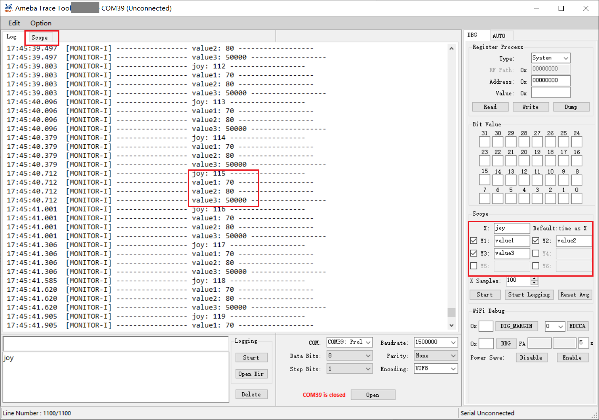
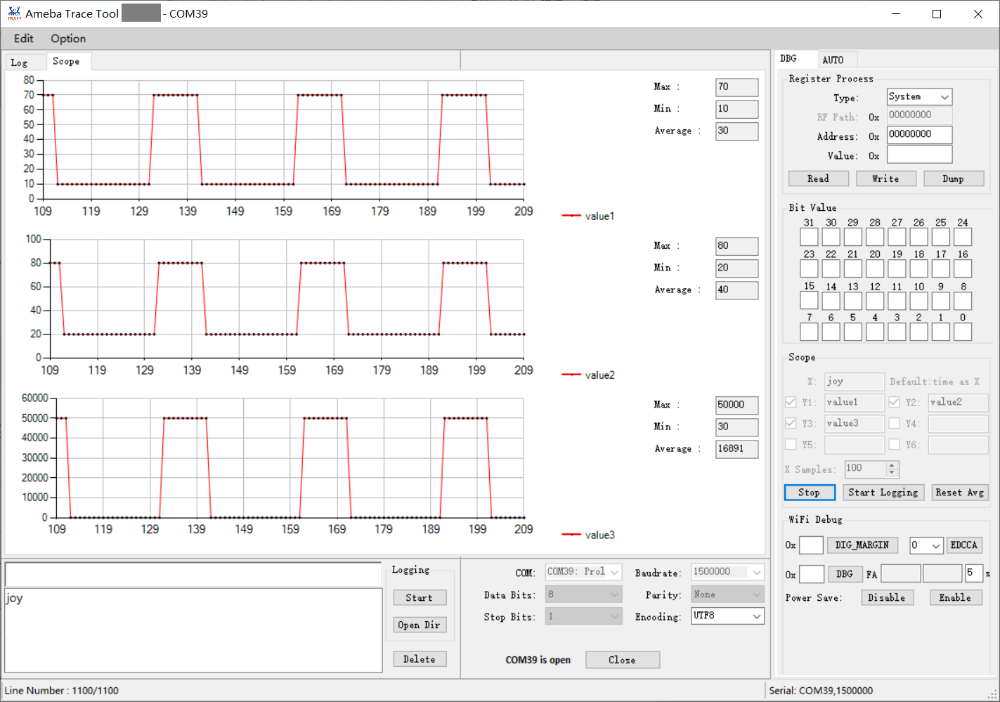

.. _trace_tool:

Introduction
------------------------
The Trace Tool is the official serial port debug tool developed by Realtek. It can be used to communicate with the device over a standard RS-232 port.
You can directly input commands into the terminal and view or record logs in real time through Trace Tool.

This chapter illustrates how to use Trace Tool to print logs and send commands. The UI of Trace Tool is shown below.
The Trace Tool can display logs when the AGG function of loguart is enabled or disabled. There are two configuration tabs in the upper left corner of UI.

- ``Edit``: the history logs clear, history commands clear, load and save.

- ``Option: Global Settings`` including row count and timestamp, and ``Tag Filter`` is used to attach different tag before logs to distinguish logs from different cores when the AGG function is enabled.

.. figure:: ../figures/trace_tool_ui.png
   :scale: 60%
   :align: center
   :name: fig1_trace_tool_ui

   Trace tool UI

By default, the AGG (aggregation) function of loguart is disabled so any serial tool can be used to display logs.
When the AGG function is enabled, every packet will be send from UART Tx module with AGG header, which is used for Trace Tool 
to distinguish multi-path data that from different cores.

The AGG function is used for multi-paths to print logs at the same time, which are KM0, KM4, BT trace and BT FW logs.
   
- When the AGG function is enabled, hardware will attach AGG header automatically. TraceTool can separate logs from different paths according to AGG header. 
  In this case, logs from BT trace and BT FW will be saved into files separately and other logs will print on screen.
  Therefore, users must use Trace Tool instead of any other serial port tools because the latter will print disordered logs.

- When the AGG function is disabled, no AGG header is attached. In this case, users can use other tools to print log as long as there is no BT trace and BT FW logs.
  But disordered logs may appear when more than one CPU are printing logs.

.. note::
   The AGG function can be enabled by setting *Boot_Agg_En* to TRUE in :file:`ameba_bootcfg.c`.

.. _trace_tool_environment_setup:

Environment Setup
----------------------------------
Hardware Connection
~~~~~~~~~~~~~~~~~~~~~~~~~~~~~~~~~~~~~~
The hardware connection is illustrated below.

   Hardware connection

.. note::
   If external UART is used to download images, the USB to UART dongle must be used.

Software Setup
~~~~~~~~~~~~~~~~~~~~~~~~~~~~
- Environment requirements: WinXP above, .NET Framework 4.0

- Software location: ``{SDK}/tools/ameba/TraceTool/AmebaTraceTool.exe``

.. note::
   The host driver for USB to UART adapter (e.g. PL2303GC) on the board shall be installed first; otherwise, the LOGUART port cannot be recognized by the host.
   Please find the exact driver from the official website of corresponding vendor of the USB to UART adapter.

Usage
----------
Log Print
~~~~~~~~~~~~~~~~~~
After setting the environment mentioned in :ref:`trace_tool_environment_setup`:

1. Select COM port.

   a. Check your COM through Device Manager in your computer, as shown below. In :guilabel:`COM & LPT` item, all the COM ports connected to the computer are listed.

      .. figure:: ../figures/port_1.PNG
         :scale: 90%
         :align: center

   b. Select COM port in :guilabel:`Port Setting` box.

      .. figure:: ../figures/port_2.png
         :scale: 75%
         :align: center

2. Set the format.

   - *Baudrate*: default is 1500000bps.

   - *Data Bits*: default is 8.

   - *Parity*: default is "None".

   - *Stop Bits*: default is 1.

   - *Encoding*: default is UTF8.

   These settings should not be changed freely. If users have to change the format setting for some reasons, the loguart format needs 
   to be changed accordingly to make sure that the format of loguart matches that of Trace Tool.

3. Click the :guilabel:`Open` button.

   - When COM port is open, the Trace Tool starts to receive logs from the device. Log is shown in Log window. By default, the timestamp is inserted at the start of each log.
   
     Click :guilabel:`Option` button, then choose :guilabel:`Global Settings` to select whether add timestamp.
     Note that the timestamp is not very accurate because log processing takes time so there is a slight time interval between receiving logs and displaying logs.

   - If COM port is closed, the Trace Tool will not display logs and the commands can't be sent.

     .. figure:: ../figures/log.png
        :scale: 90%
        :align: center

The Trace Tool supports log saving function.

- After clicking :guilabel:`Start` button in :guilabel:`Logging` box, all the receiving logs can be saved in a ``.txt`` file in the log folder of the same directory for ``.exe`` file.

  .. note::
     For segmented log, click :guilabel:`Option` and :guilabel:`Global Settings` to set log size.

- After clicking :guilabel:`Open Dir` button in :guilabel:`Logging` box, the folder where the log is stored can be opened directly.

The Trace Tool can print logs when the AGG function of loguart is enabled or disabled, because the Trace Tool can automatically detect whether the AGG function is enabled 
or not and can handle it accordingly. When the AGG function is enabled, chick :guilabel:`Option` button and choose :guilabel:`Tag Filter`, log from different cores will be added corresponding tags.
There may be a period of disorder logs when the AGG function switches from enable to disable or from disable to enable.

Command Send
~~~~~~~~~~~~~~~~~~~~~~~~
When COM port is open, you can send commands to the device through Trace Tool. The steps are shown below:

1. Input a command in command block as shown in the red block.

   .. figure:: ../figures/command_box.png
      :scale: 60%
      :align: center

   .. note::
      Refer to :ref:`command_prefix` to decide whether a command prefix is needed to add before the command.

2. Press the :guilabel:`Enter` key.

The history command box records the commands have been sent before.

- Click the command, it will be displayed in the command box.

- Double-click the command, it will be sent to the chip.

- Click the command then click :guilabel:`delete`, the command will be deleted from the history command box.

.. _command_prefix:

Command Prefix
~~~~~~~~~~~~~~~~~~~~~~~~~~~~
.. table::
   :width: 100%
   :widths: auto

   +------+------+----------------+
   | Core | Role | Command prefix |
   +======+======+================+
   | KM4  | AP   | None           |
   +------+------+----------------+
   | KM0  | NP   | @              |
   +------+------+----------------+

Debug
~~~~~~~~~~
Register Access
^^^^^^^^^^^^^^^^^^^^^^^^^^^^^^
The REG function is used to read and write registers by register address.

- ``Type``: used to select the register type. Wifi MAC/Wifi BB/Wifi RF options are used for Wi-Fi function, which have different base addresses. Select the corresponding options according to your needs.

- ``Read/Write Register``: enter the register address to ``Read`` or ``Write`` the register value. ``Dump`` means batch printing register values, only Wifi MAC/Wifi BB/Wifi RF registers are supported to be dump.

- ``Bit Value``: bitwise accessing the register specified by address.

  .. figure:: ../figures/register.png
     :scale: 75%
     :align: center
  
Scope Illustration
^^^^^^^^^^^^^^^^^^^^^^^^^^^^^^
The scope function is used to capture specific data in log and illustrate waveform dynamically.

- Enter *X* and *Y* pattern, *X* default value is time.

- Click :guilabel:`Start` button.

In the scope interface, waveform will be illustrated synchronously.

WiFi Debug
^^^^^^^^^^^^^^^^^^^^
- ``DIG_MARGIN``: set WiFi DIG margin, available address: [0x00,0x3c].

- ``EDCCA``: set MAC EDCCA mode, available value: 0/1/9.

- ``DBG``: set WiFi RA debug, avilable address: [0,0xff]. And illustrate CCK_FA and OFDM_FA average value.

- ``Power Save``: enable or disable WiFi power saving mode.

.. figure:: ../figures/wifi_debug.png
   :scale: 100%
   :align: center

AUTO Script
~~~~~~~~~~~~~~~~~~~~~~
Usage
^^^^^^^^^^
The AUTO feature is used for automatic script execution.

1. Click ``Browse`` button to choose the script you want to execute.

2. Click ``Execute`` button to execute the script.

.. figure:: ../figures/auto_script_1.png
   :scale: 100%
   :align: center

Script Format
^^^^^^^^^^^^^^^^^^^^^^^^^^
The format of script.txt which is used in auto mode is as follows:

.. code::

   CMD1
   CMD2
   CMD3
   …

- If commands are required to be repeated multiple times, loop can be used:

   .. code-block::

      loop=10
      loop_start
      CMD1
      CMD2
      sleep 1000
      …
      loop_end

   - For a loop, three key words are necessary:

      - ``Loop``: The number after ``loop=`` means loop times.

      - ``loop_start``: Used to mark the beginning of the loop.

      - ``loop_end``: Used to mark the end of the loop.

      - ``loop_start`` and ``loop_end`` have to appear in pairs.

      - ``sleep``: Used to delay some time between commands, and unit is millisecond. ``sleep 1000`` means to delay 1000ms. There should be a blank space between ``sleep`` and sleep time.

- Nested loop is supported as below:

   .. code-block::

      loop=2
      loop_start
      CMD1
      sleep 1000
      loop=3
      loop_start
      CMD2
      sleep 2000
      loop_end
      loop_end

- Catching certain patterns, like pass_pattern or fail_pattern, to indicate the result of specific CMD execution is supported, the format is as below:

   .. code-block::

      loop=10
      loop_start
      timeout=1000
      pass_pattern=xxx
      fail_patern=xxx
      CMD1
      if fail/pass/timeout
      break
      fi
      CMD2
      …
      loop_end

   - The key word ``pass_pattern`` and ``fail_pattern`` and ``timeout`` are only valid for the next command CMD1, used to catch patterns in CMD1 execution. When catching the patterns, key word ``if...fi`` can be used to perform subsequent operation, now only the ``break`` operation is supported, which is used to jump out of the loop.

     .. figure:: ../figures/auto_script_2.png
        :scale: 60%
        :align: center

   - The number after ``timeout=`` means the time frame you want to catch log to match the pattern. It can be set to different values according to needs (unit: millisecond), and default value is 5000.

   - The string after ``pass_pattern=`` means the pass_pattern, and the string after ``fail_pattern=`` means the fail_pattern, which is used to indicate the result of the CMD execution.

   When the corresponding pattern is matched or not during CMD execution, there will be three results:

   - ``Pass``: pass_pattern matched within timeout in CMD execution results.

   - ``Fail``: pass_pattern matched within timeout in CMD execution results.

   - ``Timeout``: no pass_pattern/fail_pattern matched within timeout in CMD execution results.

.. caution::
      - One command in a single line.

      - TAB is used to indent a line. Only TAB can be used, WHITE SPACE is not allowed.

      - WHITE SPACE before or after ``=`` is not allowed.

