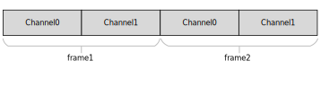
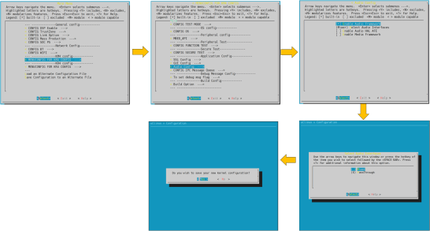
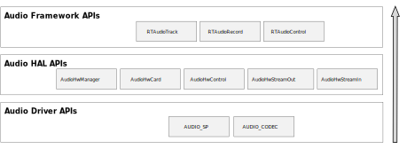
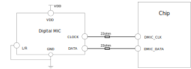
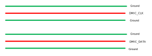
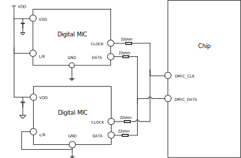
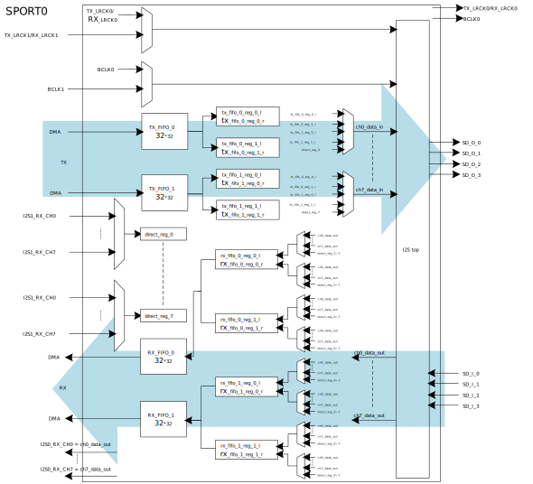
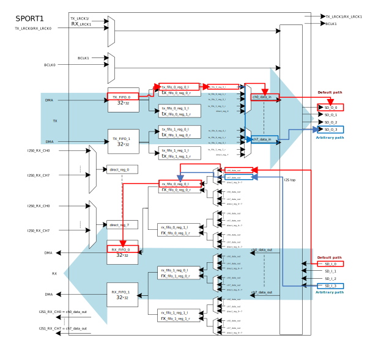
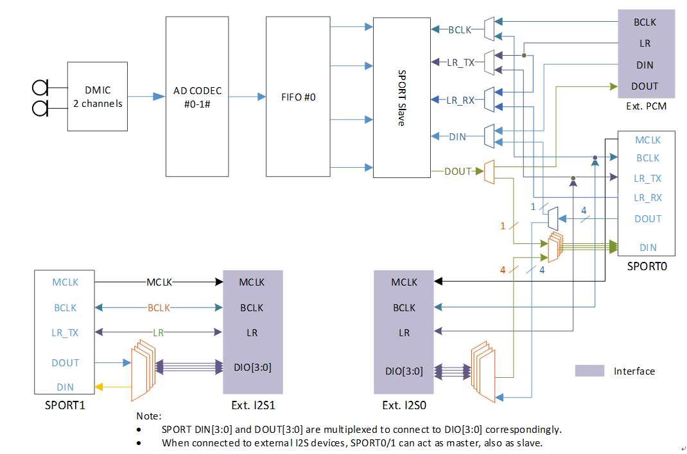

.. _audio:

Introduction
------------------------
The audio framework is a whole audio architecture aiming to provide different layers of audio interfaces for applications. The interfaces involve Audio HAL and Audio Framework.

- Audio HAL: defines unified audio hardware interfaces. It interacts with audio driver to do audio streaming or audio settings.

- Audio Framework: provides interfaces for audio streaming, and other settings.

The audio framework provides passthrough architecture which supports audio recording, and audio playback. This architecture has no audio mixing, only one audio playback is allowed at the same moment.

The audio interfaces and the entire implementation of audio passthrough architecture is shown below.

   .. figure:: ../figures/audio_passthrough_overview.svg
      :scale: 120%
      :align: center

      Audio passthrough overview

The whole audio passthrough architecture includes the following sub-modules:

- Application Interface

   - **RTAudioTrack** provides interfaces to play sound.

   - **RTAudioRecord** provides interfaces to capture sound.

   - **RTAudioControl** provides interfaces to control sound volumes and so on.

- Audio HAL

   - **AudioHwManager** provides interfaces that manage audio cards through a specific card driver program opened based on the given audio card descriptor.

   - **AudioHwCard** provides interfaces that manage audio card capabilities, including initializing ports, creating stream out and stream in.

   - **AudioHwControl** provides interfaces for RTAudioControl, and set commands to audio driver.

   - **AudioHwStreamOut** provides interfaces that get data from the upper layer and render data to audio driver user interfaces.

   - **AudioHwStreamIn** provides interfaces to capture data from audio driver user interfaces and deliver the data to the upper layer.

- Audio Driver

   - **AUDIO_SP** provides interfaces to configure audio sports.

   - **AUDIO_CODEC** provides interfaces to configure audio codec.

Terminology
----------------------
The meanings of some widely-used audio terms in this chapter are listed below.

.. list-table::
   :header-rows: 1

   * -  Terms
     -  Introduction
   * -  PCM
     -  Pulse Code Modulation, audio data is a raw stream.
   * -  channel
     -  A channel sound is an independent audio signal captured or played in different positions, so the number of
       
        channels is the number of sound sources.
   * -  mono
     -  Mono means only one single channel sound.
   * -  stereo
     -  Stereo means two channels.
   * -  bit depth
     -  Bit depth represents the bits effectively used in the process of audio signals.
       
        Sampling depth shows the resolution of the sound. The larger the value, the higher the resolution.
   * -  sample
     -  Representing the audio processing at a point in time.
   * -  sample rate
     -  The audio sampling rate refers to the number of frames that the signal is sampled per second.
       
         The higher the sampling frequency, the higher quality the sound will be.
   * -  frame
     -  A frame is a sound unit whose length is the sample length multiplies the number of channels.
   * -  gain
     -  Audio signal gain control to adjust the signal level.
   * -  interleaved
     -  It is a recording method of audio data. In the interleaved mode, the data is stored in a continuous manner,
       
        all the channels of sample of first frame are first stored, and then the storage of second frame.
   * -  latency
     -  Time delay when a signal passes through the whole system.
   * -  overrun
     -  The buffer is too full to let buffer producer write more data.
   * -  underrun
     -  The buffer producer is too slow to write data to the buffer so that the buffer is empty when the consumer
       
        wants to consume data.
   * -  xrun
     -  Overrun or underrun.
   * -  volume
     -  Volume, sound intensity and loudness.
   * -  hardware volume
     -  The volume of audio codec.
   * -  software volume
     -  The volume set in software algorithm.
   * -  resample
     -  Convert the sample rate.
   * -  reformat
     -  Convert the bit depth of the sample.
   * -  mix
     -  Mix several audio streaming together. Users can hear several audio streaming playing together.
   * -  Audio codec
     -  The DAC and ADC controller inside the chip.

Data Format
----------------------
This section describes the data format that audio framework and audio HAL supports.
The common part of audio framework and audio HAL is described here. And the different parts will be described in their own sections.

Both audio framework and audio HAL support interleaved streaming data.

The interleaved data is illustrated in the following figures.

   Two-channel interleaved

.. figure:: ../figures/audio_four_channels_interleaved.svg
   :scale: 100%
   :align: center

   Four-channel interleaved

Framework Format
~~~~~~~~~~~~~~~~~~~~~~~~~~~~~~~~
This section describes the format that Audio Framework supports. Before playback, or capture, make sure your sound format is supported.

Audio Framework has the following types of bit depth:

- *RTAUDIO_FORMAT_INVALID* - invalid bit depth of audio stream

- *RTAUDIO_FORMAT_PCM_8_BIT* - audio stream has 8-bit depth

- *RTAUDIO_FORMAT_PCM_16_BIT* - audio stream has 16-bit depth

- *RTAUDIO_FORMAT_PCM_32_BIT* - audio stream has 32-bit depth

- *RTAUDIO_FORMAT_PCM_FLOAT* - audio stream has 32-bit float format

- *RTAUDIO_FORMAT_PCM_24_BIT* - audio stream has 24-bit depth

- *RTAUDIO_FORMAT_PCM_8_24_BIT* - audio stream has 24-bit + 8-bit depth

The following table describes the supported formats for playback and recording. ``Y`` means the format is supported; ``N`` means the format is not supported.

.. table::
   :width: 100%
   :widths: 50,25,25

   +----------------------------------+----------+---------+
   | Bit depth                        | Playback | Capture |
   +==================================+==========+=========+
   | RTAUDIO_FORMAT_PCM_8_BIT         | Y        | Y       |
   +----------------------------------+----------+---------+
   | RTAUDIO_FORMAT_PCM_16_BIT        | Y        | Y       |
   +----------------------------------+----------+---------+
   | RTAUDIO_FORMAT_PCM_32_BIT        | Y        | Y       |
   +----------------------------------+----------+---------+
   | RTAUDIO_FORMAT_PCM_FLOAT         | N        | N       |
   +----------------------------------+----------+---------+
   | RTAUDIO_FORMAT_PCM_24_BIT        | Y        | Y       |
   +----------------------------------+----------+---------+
   | RTAUDIO_FORMAT_PCM_8_24_BIT      | Y        | Y       |
   +----------------------------------+----------+---------+

The sample rate is another important format of audio streaming. For playback and recording, audio framework supports the following sample rates.
``Y`` means the sample rate is supported; ``N`` means the sample rate is not supported.

.. table::
   :width: 100%
   :widths: 50,25,25

   +-------------+----------+---------+
   | Sample rate | Playback | Capture |
   +=============+==========+=========+
   | 8000        | Y        | Y       |
   +-------------+----------+---------+
   | 11025       | Y        | Y       |
   +-------------+----------+---------+
   | 16000       | Y        | Y       |
   +-------------+----------+---------+
   | 22050       | Y        | Y       |
   +-------------+----------+---------+
   | 32000       | Y        | Y       |
   +-------------+----------+---------+
   | 44100       | Y        | Y       |
   +-------------+----------+---------+
   | 48000       | Y        | Y       |
   +-------------+----------+---------+
   | 88200       | Y        | Y       |
   +-------------+----------+---------+
   | 96000       | Y        | Y       |
   +-------------+----------+---------+
   | 192000      | Y        | Y       |
   +-------------+----------+---------+

To do audio streaming, the channel count parameter setting is necessary, too. For playback and recording, audio framework supports the following channel counts.
``Y`` means the channel count is supported; ``N`` means the channel count is not supported.

.. table::
   :width: 100%
   :widths: 50,25,25

   +---------------+----------+---------+
   | Channel count | Playback | Capture |
   +===============+==========+=========+
   | 1             | Y        | Y       |
   +---------------+----------+---------+
   | 2             | Y        | Y       |
   +---------------+----------+---------+
   | 4             | Y        | Y       |
   +---------------+----------+---------+
   | 6             | Y        | Y       |
   +---------------+----------+---------+
   | 8             | Y        | Y       |
   +---------------+----------+---------+

HAL Format
~~~~~~~~~~~~~~~~~~~~
Audio Hal has the following types of bit depth:

- *AUDIO_HW_FORMAT_INVALID* - invalid bit depth of audio stream

- *AUDIO_HW_FORMAT_PCM_8_BIT* - audio stream has 8-bit depth

- *AUDIO_HW_FORMAT_PCM_16_BIT* - audio stream has 16-bit depth

- *AUDIO_HW_FORMAT_PCM_32_BIT* - audio stream has 32-bit depth

- *AUDIO_HW_FORMAT_PCM_FLOAT* - audio stream has 32-bit float format

- *AUDIO_HW_FORMAT_PCM_24_BIT* - audio stream has 24-bit depth

- *AUDIO_HW_FORMAT_PCM_8_24_BIT* - audio stream has 24-bit + 8-bit depth

If using the Audio HAL interface, check the bit depth HAL supported for Playback and Capture.
``Y`` means the format is supported; ``N`` means the format is not supported.

.. table::
   :width: 100%
   :widths: 50,25,25

   +-----------------------------------+----------+---------+
   | Bit depth                         | Playback | Capture |
   +===================================+==========+=========+
   | AUDIO_HW_FORMAT_PCM_8_BIT         | Y        | Y       |
   +-----------------------------------+----------+---------+
   | AUDIO_HW_FORMAT_PCM_16_BIT        | Y        | Y       |
   +-----------------------------------+----------+---------+
   | AUDIO_HW_FORMAT_PCM_32_BIT        | Y        | Y       |
   +-----------------------------------+----------+---------+
   | AUDIO_HW_FORMAT_PCM_FLOAT         | N        | N       |
   +-----------------------------------+----------+---------+
   | AUDIO_HW_FORMAT_PCM_24_BIT        | N        | N       |
   +-----------------------------------+----------+---------+
   | AUDIO_HW_FORMAT_PCM_8_24_BIT      | Y        | Y       |
   +-----------------------------------+----------+---------+

The sample rate is another important format of HAL audio streaming. For playback and recording, audio HAL supports the following sample rates.
``Y`` means the sample rate is supported; ``N`` means the sample rate is not supported.

.. table::
   :width: 100%
   :widths: 50,25,25

   +-------------+----------+---------+
   | Sample rate | Playback | Capture |
   +=============+==========+=========+
   | 8000        | Y        | Y       |
   +-------------+----------+---------+
   | 11025       | Y        | Y       |
   +-------------+----------+---------+
   | 16000       | Y        | Y       |
   +-------------+----------+---------+
   | 22050       | Y        | Y       |
   +-------------+----------+---------+
   | 32000       | Y        | Y       |
   +-------------+----------+---------+
   | 44100       | Y        | Y       |
   +-------------+----------+---------+
   | 48000       | Y        | Y       |
   +-------------+----------+---------+
   | 88200       | Y        | Y       |
   +-------------+----------+---------+
   | 96000       | Y        | Y       |
   +-------------+----------+---------+
   | 192000      | Y        | Y       |
   +-------------+----------+---------+

To do audio streaming, the channel count parameter setting is necessary, too. For playback and recording, audio HAL supports the following channel counts.
``Y`` means the channel count is supported; ``N`` means the channel count is not supported.

.. table::
   :width: 100%
   :widths: 50,25,25

   +---------------+----------+---------+
   | Channel count | Playback | Capture |
   +===============+==========+=========+
   | 1             | Y        | Y       |
   +---------------+----------+---------+
   | 2             | Y        | Y       |
   +---------------+----------+---------+
   | 4             | Y        | Y       |
   +---------------+----------+---------+
   | 6             | Y        | Y       |
   +---------------+----------+---------+
   | 8             | Y        | Y       |
   +---------------+----------+---------+

Architecture
------------------------
Playback Architecture
~~~~~~~~~~~~~~~~~~~~~~~~~~~~~~~~~~~~~~~~~~
The block diagram of audio playback architecture is shown below.

.. figure:: ../figures/audio_playback_architecture.svg
   :scale: 100%
   :align: center

   Playback architecture

The audio playback architecture includes the following sub-modules:

- **Audio Framework**: provides interfaces for applications.

- **Audio HAL**: gets playback data from audio framework, and sends the data to audio driver.

- **Audio Driver**: gets playback data from audio HAL and sends data to audio hardware.

Record Architecture
~~~~~~~~~~~~~~~~~~~~~~~~~~~~~~~~~~~~~~
The block diagram of audio record architecture is shown below.

.. figure:: ../figures/audio_record_architecture.svg
   :scale: 100%
   :align: center

   Record architecture

The audio record architecture includes the following sub-modules:

- **RTAudioRecord**: captures data from Audio HAL, and provides data to audio applications, which want to record data.

- **Audio HAL**: gets record data from Audio driver, and sends the data to RTAudioRecord.

- **Audio Driver**: gets record data from Audio hardware, and sends data to audio HAL.

Control Architecture
~~~~~~~~~~~~~~~~~~~~~~~~~~~~~~~~~~~~~~~~
The block diagram of audio control architecture is shown below.

.. figure:: ../figures/audio_control_architecture.svg
   :scale: 90%
   :align: center

   Control architecture

The audio control architecture includes the following sub-modules:

- **RTAudioControl**: called by Apps, and interacts with HAL to do audio control settings.

- **Audio HAL**: does audio control settings by calling Driver APIs.

- **Audio Driver**: controls audio codec hardware.

Configurations
----------------------------
MenuConfig
~~~~~~~~~~~~~~~~~~~~
If users want to use audio interfaces, select the following audio configurations, and choose audio architecture: *passthrough*.

HAL Configuration
~~~~~~~~~~~~~~~~~~~~~~~~~~~~~~~~~~
Audio hardware configurations lie in ``{SDK}/component/soc/amebadplus/usrcfg/include/ameba_audio_hw_usrcfg.h``.

Different boards have different configurations.
For example, some boards need to use an amplifier, while others do not. Different boards may use different pins to enable the amplifier; the start-up time is different for different amplifiers.
In addition, the pins used by each board's DMICs may be different, and the stable time of DMICs may be different.
All the information needs to be configured in the configuration file.

The ``ameba_audio_hw_usrcfg.h`` file has the description for each configuration, please set them according to the description.

Interfaces
--------------------
The audio component provides two layers of interfaces.

.. table::
   :width: 100%
   :widths: 30, 70

   +----------------------------+----------------------------------------------------------------------------------------+
   | Interface layers           | Introduction                                                                           |
   +============================+========================================================================================+
   | Audio Driver Interfaces    | Audio Hardware Interfaces.                                                             |
   +----------------------------+----------------------------------------------------------------------------------------+
   | Audio HAL Interfaces       | Audio Hardware Abstraction Layer Interfaces.                                           |
   +----------------------------+----------------------------------------------------------------------------------------+
   | Audio Framework Interfaces | High-level Interfaces for applications to render/capture stream, set volume and so on. |
   +----------------------------+----------------------------------------------------------------------------------------+

The interfaces layer is shown below.

   Audio interfaces

Driver Interfaces
~~~~~~~~~~~~~~~~~
Audio Clock and Function APIs
^^^^^^^^^^^^^^^^^^^^^^^^^^^^^
.. table::
   :width: 100%
   :widths: 30, 70

   +-----------------------------+---------------------------------------------------------+
   | API                         | Introduction                                            |
   +=============================+=========================================================+
   | RCC_PeriphClockCmd          | Enable or disable the APB peripheral clock and function |
   +-----------------------------+---------------------------------------------------------+
   | RCC_PeriphClockSource_SPORT | Configure SPORT clock                                   |
   +-----------------------------+---------------------------------------------------------+

SPORT APIs
^^^^^^^^^^^^^^^^^^^^
.. table::
   :width: 100%
   :widths: 30, 70
   :class: longtable

   +------------------------------+---------------------------------------------------------------------------------------------+
   | API                          | Introduction                                                                                |
   +==============================+=============================================================================================+
   | AUDIO_SP_StructInit          | Fill each SP_StructInit member with its default value                                       |
   +------------------------------+---------------------------------------------------------------------------------------------+
   | AUDIO_SP_Register            | Register audio SPORT with its index, direction, and SP_StructInit members.                  |
   +------------------------------+---------------------------------------------------------------------------------------------+
   | AUDIO_SP_Unregister          | Unregister audio SPORT with its index                                                       |
   +------------------------------+---------------------------------------------------------------------------------------------+
   | AUDIO_SP_Reset               | Reset SPORT module                                                                          |
   +------------------------------+---------------------------------------------------------------------------------------------+
   | AUDIO_SP_GetTXChnLen         | Get audio SPORT Tx channel length                                                           |
   +------------------------------+---------------------------------------------------------------------------------------------+
   | AUDIO_SP_GetRXChnLen         | Get audio SPORT Rx channel length                                                           |
   +------------------------------+---------------------------------------------------------------------------------------------+
   | AUDIO_SP_SetTXClkDiv         | Set audio SPORT Tx BCLK divider factor                                                      |
   +------------------------------+---------------------------------------------------------------------------------------------+
   | AUDIO_SP_SetRXClkDiv         | Set audio SPORT Rx BCLK divider factor                                                      |
   +------------------------------+---------------------------------------------------------------------------------------------+
   | AUDIO_SP_SetMclk             | Set audio SPORT MCLK enable or disable                                                      |
   +------------------------------+---------------------------------------------------------------------------------------------+
   | AUDIO_SP_SetMclkDiv          | Set audio SPORT MCLK divider factor                                                         |
   +------------------------------+---------------------------------------------------------------------------------------------+
   | AUDIO_SP_SetFixBclk          | Set audio SPORT fixed BLCK mode                                                             |
   +------------------------------+---------------------------------------------------------------------------------------------+
   | AUDIO_SP_SelFixBclk          | Select audio SPORT BCLK divider factor                                                      |
   +------------------------------+---------------------------------------------------------------------------------------------+
   | AUDIO_SP_TXCHNSrcSel         | Select audio SPORT Tx channel source                                                        |
   +------------------------------+---------------------------------------------------------------------------------------------+
   | AUDIO_SP_RXFIFOSrcSel        | Select audio SPORT Rx FIFO source                                                           |
   +------------------------------+---------------------------------------------------------------------------------------------+
   | AUDIO_SP_TXSetFifo           | Set audio SPORT TX FIFO enable or disable                                                   |
   +------------------------------+---------------------------------------------------------------------------------------------+
   | AUDIO_SP_RXSetFifo           | Set audio SPORT RX FIFO enable or disable                                                   |
   +------------------------------+---------------------------------------------------------------------------------------------+
   | AUDIO_SP_Init                | Initialize the audio SPORT registers according to the specified parameters in SP_InitStruct |
   +------------------------------+---------------------------------------------------------------------------------------------+
   | AUDIO_SP_TXStart             | Start or stop SPORT Tx path                                                                 |
   +------------------------------+---------------------------------------------------------------------------------------------+
   | AUDIO_SP_RXStart             | Start or stop SPORT Rx path                                                                 |
   +------------------------------+---------------------------------------------------------------------------------------------+
   | AUDIO_SP_DmaCmd              | SPORT and GDMA handshake on or off                                                          |
   +------------------------------+---------------------------------------------------------------------------------------------+
   | AUDIO_SP_SetSelfLPBK         | Set SPORT self-loopback mode                                                                |
   +------------------------------+---------------------------------------------------------------------------------------------+
   | AUDIO_SP_SetTXWordLen        | Set audio SPORT Tx word length                                                              |
   +------------------------------+---------------------------------------------------------------------------------------------+
   | AUDIO_SP_SetRXWordLen        | Set audio SPORT Rx word length                                                              |
   +------------------------------+---------------------------------------------------------------------------------------------+
   | AUDIO_SP_GetTXWordLen        | Get audio SPORT Tx word length                                                              |
   +------------------------------+---------------------------------------------------------------------------------------------+
   | AUDIO_SP_GetRXWordLen        | Get audio SPORT Rx word length                                                              |
   +------------------------------+---------------------------------------------------------------------------------------------+
   | AUDIO_SP_SetMonoStereo       | Set the audio SPORT channel number                                                          |
   +------------------------------+---------------------------------------------------------------------------------------------+
   | AUDIO_SP_SetMasterSlave      | Set the audio SPORT master or slave mode                                                    |
   +------------------------------+---------------------------------------------------------------------------------------------+
   | AUDIO_SP_TXGDMA_Init         | Initialize GDMA peripheral single block mode for sending data                               |
   +------------------------------+---------------------------------------------------------------------------------------------+
   | AUDIO_SP_RXGDMA_Init         | Initialize GDMA peripheral single block mode for receiving data                             |
   +------------------------------+---------------------------------------------------------------------------------------------+
   | AUDIO_SP_TXGDMA_Restart      | Audio GDMA TX restart in isr                                                                |
   +------------------------------+---------------------------------------------------------------------------------------------+
   | AUDIO_SP_RXGDMA_Restart      | Audio GDMA RX restart in isr                                                                |
   +------------------------------+---------------------------------------------------------------------------------------------+
   | AUDIO_SP_LLPTXGDMA_Init      | Initialize Link-list mode GDMA peripheral for Tx data                                       |
   +------------------------------+---------------------------------------------------------------------------------------------+
   | AUDIO_SP_LLPRXGDMA_Init      | Initialize Link-list mode GDMA peripheral for Rx data                                       |
   +------------------------------+---------------------------------------------------------------------------------------------+
   | AUDIO_SP_SetTXCounter        | Enable or disable SPORT TX counter interrupt                                                |
   +------------------------------+---------------------------------------------------------------------------------------------+
   | AUDIO_SP_SetTXCounterCompVal | Set SPORT Tx counter compare value                                                          |
   +------------------------------+---------------------------------------------------------------------------------------------+
   | AUDIO_SP_ClearTXCounterIrq   | Clear SPORT Tx counter IRQ                                                                  |
   +------------------------------+---------------------------------------------------------------------------------------------+
   | AUDIO_SP_SetPhaseLatch       | Set SPORT phase latch                                                                       |
   +------------------------------+---------------------------------------------------------------------------------------------+
   | AUDIO_SP_GetTXCounterVal     | Get SPORT Tx counter value                                                                  |
   +------------------------------+---------------------------------------------------------------------------------------------+
   | AUDIO_SP_GetTXPhaseVal       | Get SPORT Tx phase value when channel length is 32bit, none of the other bits will do       |
   +------------------------------+---------------------------------------------------------------------------------------------+
   | AUDIO_SP_SetRXCounter        | Enable or disable SPORT RX counter interrupt                                                |
   +------------------------------+---------------------------------------------------------------------------------------------+
   | AUDIO_SP_SetRXCounterCompVal | Set SPORT Rx counter compare value                                                          |
   +------------------------------+---------------------------------------------------------------------------------------------+
   | AUDIO_SP_ClearRXCounterIrq   | Clear SPORT Rx counter IRQ                                                                  |
   +------------------------------+---------------------------------------------------------------------------------------------+
   | AUDIO_SP_GetRXCounterVal     | Get SPORT Rx counter value                                                                  |
   +------------------------------+---------------------------------------------------------------------------------------------+
   | AUDIO_SP_GetRXPhaseVal       | Get SPORT RX phase when channel length is 32bit, none of the other bits will do             |
   +------------------------------+---------------------------------------------------------------------------------------------+
   | AUDIO_SP_SetDirectOutMode    | Set SPORT directout mode                                                                    |
   +------------------------------+---------------------------------------------------------------------------------------------+
   | AUDIO_SP_Deinit              | De-initialize the audio SPORT index and direction                                           |
   +------------------------------+---------------------------------------------------------------------------------------------+
   | AUDIO_SP_SetPinMux           | Set the AUDIO SPORT pinmux function mux: dout or din                                        |
   +------------------------------+---------------------------------------------------------------------------------------------+

Codec APIs
^^^^^^^^^^^^^^^^^^^^
.. table::
   :width: 100%
   :widths: 30, 70
   :class: longtable

   +-------------------------------+-------------------------------------------------------------------------+
   | API                           | Introduction                                                            |
   +===============================+=========================================================================+
   | AUDIO_CODEC_SetAudioIP        | Enable or disable audio codec IP                                        |
   +-------------------------------+-------------------------------------------------------------------------+
   | AUDIO_CODEC_SetI2SIP          | Enable or disable I2S IP                                                |
   +-------------------------------+-------------------------------------------------------------------------+
   | AUDIO_CODEC_SetI2SSRC         | Select I2S master source.                                               |
   +-------------------------------+-------------------------------------------------------------------------+
   | AUDIO_CODEC_SetI2SRXTDM       | Select I2S Rx and I2S Rx TDM mode                                       |
   +-------------------------------+-------------------------------------------------------------------------+
   | AUDIO_CODEC_I2S_StructInit    | Default I2S initialization parameter                                    |
   +-------------------------------+-------------------------------------------------------------------------+
   | AUDIO_CODEC_SetI2SParameters  | Set I2S initialization parameter                                        |
   +-------------------------------+-------------------------------------------------------------------------+
   | AUDIO_CODEC_SetADCSRSrc       | Select ADC sample rate and source, all ADC share source and sample rate |
   +-------------------------------+-------------------------------------------------------------------------+
   | AUDIO_CODEC_EnableADC         | Enable or disable per AD and AD FIFO channel clock                      |
   +-------------------------------+-------------------------------------------------------------------------+
   | AUDIO_CODEC_SetADCVolume      | Set the gain of ADC digital volume                                      |
   +-------------------------------+-------------------------------------------------------------------------+
   | AUDIO_CODEC_SetADCHPF         | Set per ADC channel HPF mode and select HPF FC                          |
   +-------------------------------+-------------------------------------------------------------------------+
   | AUDIO_CODEC_SetADCASRC        | Set ADC ASRC mode                                                       |
   +-------------------------------+-------------------------------------------------------------------------+
   | AUDIO_CODEC_SetADCMute        | Mute ADC path                                                           |
   +-------------------------------+-------------------------------------------------------------------------+
   | AUDIO_CODEC_SetADCMixMute     | Set per ADC mix mute AD input path to mute or unmute                    |
   +-------------------------------+-------------------------------------------------------------------------+
   | AUDIO_CODEC_SetADCDmicFilter  | Enable per DIMC channel filter clock                                    |
   +-------------------------------+-------------------------------------------------------------------------+
   | AUDIO_CODEC_SetDmicClk        | Enable and select DMIC clock                                            |
   +-------------------------------+-------------------------------------------------------------------------+
   | AUDIO_CODEC_SetDmicSrc        | Select DMIC input ADC channel                                           |
   +-------------------------------+-------------------------------------------------------------------------+
   | AUDIO_CODEC_SetADCEQClk       | Enable or disable ADC channel EQ clock                                  |
   +-------------------------------+-------------------------------------------------------------------------+
   | AUDIO_CODEC_SetADCEQFilter    | Set EQ band as filter for DMIC Rx                                       |
   +-------------------------------+-------------------------------------------------------------------------+
   | AUDIO_CODEC_SetADCEQBand      | Enable or disable ADC channel EQ band                                   |
   +-------------------------------+-------------------------------------------------------------------------+
   | AUDIO_CODEC_SetADCZDET        | Set ADC path zero detection function                                    |
   +-------------------------------+-------------------------------------------------------------------------+
   | AUDIO_CODEC_SetADCZDETTimeOut | Set ADC path zero detection time out                                    |
   +-------------------------------+-------------------------------------------------------------------------+
   | AUDIO_CODEC_Record            | Audio codec record flow for test                                        |
   +-------------------------------+-------------------------------------------------------------------------+

I2S PLL APIs
^^^^^^^^^^^^^^^^^^^^^^^^
.. list-table::
   :header-rows: 1

   * -  API
     -  Introduction
   * -  PLL_I2S0_CLK
     -  I2S0 CPU PLL CLOCK choose when system clock is an integer multiple of 98.304M or 45.1584M
   * -  PLL_I2S1_CLK
     -  I2S1 CPU PLL CLOCK choose when system clock is an integer multiple of 98.304M or 45.1584M
   * -  PLL_I2S0_CLK_Auto
     -  I2S0 CPU PLL CLOCK auto choose when system clock is not an integer multiple of 98.304M
       
        or 45.1584M
   * -  PLL_I2S1_CLK_Auto
     -  I2S1 CPU PLL CLOCK auto choose when system clock is not an integer multiple of 98.304M
       
        or 45.1584M
   * -  PLL_I2S_CLKGet
     -  Get 98.304M or 45.1584M
   * -  PLL_I2S_98P304M_ClkTune
     -  I2S PLL output adjust by ppm when system clock is an integer multiple of 98.304M
   * -  PLL_I2S_45P1584M_ClkTune
     -  I2S PLL output adjust by ppm when system clock is an integer multiple of 45.1584M

There are two ways to generate I2S PLL:
- One is that the system clock is an integer multiple of 98.304M or 45.1584M, we add the system clock in *SocClk_Info* array, so you can modify the index of *SocClk_Info* array in :file:`bootloader_km4.c`.
  When you need high-quality audio applications, you can use this method.

- The other is that the system clock is not an integer multiple of 98.304M or 45.1584M, in this case, we automatically get the 98.304M or 45.1584M.

The details are shown in the following figure.

.. figure:: ../figures/audio_i2s_pll_interfaces.svg
   :scale: 130%T
   :align: center

   Flow of using I2S PLL interfaces

HAL Interfaces
~~~~~~~~~~~~~~~~~~~~~~~~~~~~
Audio HAL provides AudioHwStreamOut/AudioHwStreamIn/AudioHwControl interfaces to interact with audio hardware. The interfaces lie in ``{SDK}/component/audio/interfaces/hardware/audio``.
The interfaces have specific descriptions in them, read them before use.

- **AudioHwStreamOut**: receives PCM data from the upper layer, writes data via audio driver to send PCM data to hardware, and provides information about audio output hardware driver.

- **AudioHwStreamIn**: receives PCM data via audio driver and sends to the upper layer.

- **AudioHwControl**: receives control calling from the upper layer, and sets control information to the driver.

The AudioHwStreamOut/AudioHwStreamIn is managed by AudioHwCard interface. It is responsible for creating/destroying AudioHwStreamOut/AudioHwStreamIn instance.
AudioHwCard is a physical or virtual hardware to process audio stream. It contains a set of ports and devices as shown in following figure.

- *Port* – the stream output/input of the audio card is called “port”.

- *Device* – The device output/input of audio card is called device.

.. figure:: ../figures/audio_hal_architecture.svg
   :scale: 90%
   :align: center

   AudioHwCard example

The AudioHwManager manages system's all AudioHwCards and opens a specific card driver based on the given audio card descriptor.

Using AudioHwStreamOut
^^^^^^^^^^^^^^^^^^^^^^^^^^^^^^^^^^^^^^
Users can check the example of AudioHwStreamOut in ``{SDK}/component/example/audio/audio_hal_render``.

Here is the description showing how to use audio HAL interfaces to play audio raw data (PCM format):

1. Use :func:`CreateAudioHwManager()` to get AudioHwManager instance:

   .. code-block:: c

      struct AudioHwManager *audio_manager = CreateAudioHwManager();

2. Use :func:`GetCards()` to get all audio card descriptors:

   .. code-block:: c

      int32_t cards_size = audio_manager->GetCardsCount(audio_manager);
      struct AudioHwCardDescriptor *card_descs = audio_manager->GetCards(audio_manager);

3. Choose a specific card to play (currently audio manager only support primary audio card):

   .. code-block:: c

      struct AudioHwCardDescriptor *audio_card_desc;
      for (int32_t index = 0; index < cards_size; index++) {
         struct AudioHwCardDescriptor *desc = &card_descs[index];
         for (uint32_t port = 0; (desc != NULL && port < desc->port_num); port++) {
            printf("check for audio port \n");
            if (desc->ports[port].role == AUDIO_HW_PORT_ROLE_OUT &&
               (audio_card = audio_manager->OpenCard(audio_manager, desc))) {
               audio_port = desc->ports[port];
               audio_card_desc = desc;
               break;
            }
         }
      }

4. Create AudioHwConfig according to the sample rate, channel, format, and AudioHwPathDescriptor, then use :func:`CreateStreamOut()` to create an AudioHwStreamOut based on the specific audio card:

   .. code-block:: c

      struct AudioHwConfig audio_config;
      audio_config.sample_rate = 48000;
      audio_config.channel_count = 2;
      audio_config.format = AUDIO_HW_FORMAT_PCM_16_BIT;
      struct AudioHwPathDescriptor path_desc;
      path_desc.port_index = audio_port.port_index;
      path_desc.devices = AUDIO_HW_DEVICE_OUT_SPEAKER;
      path_desc.flags = AUDIO_HW_INPUT_FLAG_NONE;
      audio_stream_out = audio_card->CreateStreamOut(audio_card, &path_desc, &audio_config);

5. Write PCM data to AudioHwStreamOut repeatly. Buffer size written can be defined by users. Users need to make sure the *size/frame_size* is integer.

   .. code-block:: c

      int32_t bytes = audio_stream_out->Write(audio_stream_out, buffer, size, true);

6. Use :func:`DestroyStreamOut()` to close AudioHwStreamOut when finishing playing:

   .. code-block:: c

      audio_card->DestroyStreamOut(audio_card, audio_stream_out);

7. Use :func:`CloseCard()` to destroy the AudioHwCard and finally call DestoryAudioHwManager to release AudioHwManager instance:

   .. code-block:: c

      audio_manager->CloseCard(audio_manager, audio_card, audio_card_desc);
      DestoryAudioHwManager(audio_manager);

Using AudioHwStreamIn
^^^^^^^^^^^^^^^^^^^^^^^^^^^^^^^^^^^^^^^^
Users can check the example of AudioHwStreamOut in ``{SDK}/component/example/audio/audio_hal_capture``.

Here is the description showing how to use audio HAL interfaces to capture audio raw data:

1. Use :func:`CreateAudioHwManager()` to get AudioHwManager instance:

   .. code-block:: c

      struct AudioHwManager *audio_manager = CreateAudioHwManager();

2. Use :func:`GetCards()` to get all audio card descriptors:

   .. code-block:: c

      int32_t cards_size = audio_manager->GetCardsCount(audio_manager);
      struct AudioHwCardDescriptor *card_descs = audio_manager->GetCards(audio_manager);

3. Choose a specific card to capture (currently audio manager only support primary audio card):

   .. code-block:: c

      struct AudioHwCardDescriptor *audio_card_in_desc = NULL;
      for (int32_t index = 0; index < cards_size; index++) {
         struct AudioHwCardDescriptor *desc = &card_descs[index];
         for (uint32_t port = 0; (desc != NULL && port < desc->port_num); port++) {
            if (desc->ports[port].role == AUDIO_HW_PORT_ROLE_IN &&
               (audio_card_in = audio_manager->OpenCard(audio_manager, desc))) {
               audio_port_in = desc->ports[port];
               audio_card_in_desc = desc;
               break;
            }
         }
      }

4. Construct AudioHwConfig according to the sample rate, channel, format, and AudioHwPathDescriptor, then use :func:`CreateStreamIn()` to create an AudioHwStreamIn based on the specific audio card:

   .. code-block:: c

      struct AudioHwConfig audio_config;
      audio_config.sample_rate = 48000;
      audio_config.channel_count = 2;
      audio_config.format = AUDIO_HW_FORMAT_PCM_16_BIT;
      struct AudioHwPathDescriptor path_desc_in;
      path_desc_in.port_index = audio_port_in.port_index;
      path_desc_in.devices = AUDIO_HW_DEVICE_IN_MIC;
      path_desc_in.flags = AUDIO_HW_INPUT_FLAG_NONE;
      audio_stream_in = audio_card_in->CreateStreamIn(audio_card_in, &path_desc_in, &audio_config);

5. Read PCM data from AudioHwStreamIn repeatly. This size can be defined by users. Users need to make sure the *size/frame_size* is integer.

   .. code-block:: c

      audio_stream_in->Read(audio_stream_in, buffer, size);

6. Use :func:`DestroyStreamIn()` to close AudioHwStreamIn when finishing recording:

   .. code-block:: c
   
      audio_card_in->DestroyStreamIn(audio_card_in, audio_stream_in);

7. Use :func:`CloseCard()` to destroy the AudioHwCard, and finally call :func:`DestoryAudioHwManager()` to release AudioHwManager instance.

   .. code-block:: c

      audio_manager->CloseCard(audio_manager, audio_card_in, audio_card_in_desc);
      DestoryAudioHwManager(audio_manager);

Using AudioHwControl
^^^^^^^^^^^^^^^^^^^^^^^^^^^^^^^^^^^^^^^^
Here is an example showing how to use audio HAL interfaces to control audio codec:

AudioHwCotrol is always thread-safe, and the calling is convenient. To use AudioHwCotrol, the first parameter of the function call should always be :func:`GetAudioHwControl()`.
Take the PLL clock setting for example:

.. code-block:: c

   GetAudioHwControl()->AdjustPLLClock(GetAudioHwControl(), rate, ppm, action);

Framework Interfaces
~~~~~~~~~~~~~~~~~~~~~~~~~~~~~~~~~~~~~~~~
Streaming Interfaces
^^^^^^^^^^^^^^^^^^^^^^^^^^^^^^^^^^^^^^^^
Audio Streaming Interfaces include RTAudioTrack and RTAudioRecord interfaces. The interfaces lie in ``{SDK}/component/audio/interfaces/audio``.
The interfaces have specific descriptions in them, please read them before using.

- **RTAudioTrack**: initializes the format of playback data streaming in the framework, receives PCM data from the application, and writes data to Audio HAL.

- **RTAudioRecord**: initializes the format of record data streaming in the framework, receives PCM data from Audio HAL, and sends data to applications.

Using RTAudioTrack
************************************
RTAudioTrack includes support for playing variety of common audio raw format types so that audio can be easily integrated into applications.

Audio Framework has the following audio playback category types.
Applications can use the types to initialize RTAudioTrack. Framework gets the category type and does the volume mixing according to the types.

- *RTAUDIO_CATEGORY_MEDIA* - if the application wants to play music, then its type is *RTAUDIO_CATEGORY_MEDIA*, it can use this type to init RTAudioTrack. Then audio framework will know its type, and mix it with media's volume.

- *RTAUDIO_CATEGORY_COMMUNICATION* - if the application wants to start a phone call, it can output the phone call's sound, the sound's type should be *RTAUDIO_CATEGORY_COMMUNICATION*.

- *RTAUDIO_CATEGORY_SPEECH* - if the application wants to do voice recognition, and output the speech sound.

- *RTAUDIO_CATEGORY_BEEP* - if the sound is key tone, or other beep sound, then its type is *RTAUDIO_CATEGORY_BEEP*.

The test demo of RTAudioTrack lies in ``{SDK}/component/example/audio/audio_track``.

Here is an example showing how to play audio raw data:

1. Before using RTAudioTrack, RTAudioService should be initialized:

   .. code-block:: c

      RTAudioService_Init();

2. To use RTAudioTrack to play a sound, create it:

   .. code-block:: c

      struct RTAudioTrack* audio_track = RTAudioTrack_Create();

   Apps can use the Audio Configs API to provide detailed audio information about a specific audio playback source, including stream type (type of playback source), format, number of channels, sample rate, and RTAudioTrack ringbuffer size. The syntax is as follows:

   .. code-block:: c
      
      typedef struct {
      uint32_t category_type;
      uint32_t sample_rate;
      uint32_t channel_count;
      uint32_t format;
      uint32_t buffer_bytes;
      } RTAudioTrackConfig;

   Where

   :category_type: define the stream type of the playback data source.

   :sample_rate: playback source raw data's rate.

   :channel_count: playback source raw data's channel number.

   :format: playback source raw data's bit depth.

   :buffer_bytes: ringbuffer size for RTAudioTrack to avoid xrun.

   .. note::

      The *buffer_bytes* in RTAudioTrackConfig is very important. The buffer size should always be more than the minimum buffer size Audio framework calculated.
      Otherwise overrun will occur.

   Use the interface to get minimum RTAudioTrack buffer bytes, and use it as a reference to define RTAudioTrack buffer size, for example, you can use minimum buffer size*4 as buffer size. The bigger size you use, the smoother playing you will get, yet it may cause more latency. It's your choice to define the size.

   .. code-block:: c

      int track_buf_size = RTAudioTrack_GetMinBufferBytes(audio_track, type, rate, format, channels) * 4;

1. Use this buffer size and other audio parameters to create RTAudioTrackConfig object, here's an example:

   .. code-block:: c

      RTAudioTrackConfig track_config;
      track_config.category_type = RTAUDIO_CATEGORY_MEDIA;
      track_config.sample_rate = rate;
      track_config.format = format;
      track_config.buffer_bytes = track_buf_size;
      track_config.channel_count = channel_count;

   With RTAudioTrackConfig object, we can initialize RTAudioTrack. In this step, a ringbuffer will be created according to the buffer bytes.

   .. code-block:: c

      RTAudioTrack_Init(audio_track, &track_config);

2. When all the preparations are completed, start RTAudioTrack and check if starts success.

   .. code-block:: c

      if(RTAudioTrack_Start(audio_track) != 0){
      //track start fail
      }

3. Write audio data to the framework. The write_size can be defined by users. Users need to make sure the *write_size/frame_size* is integer.

   .. code-block:: c

      RTAudioTrack_Write(audio_track, buffer, write_size, true);

4. If users want to pause, stop writing data, and then call the following APIs to tell the framework to do pause:

   .. code-block:: c

      RTAudioTrack_Pause(audio_track);
      RTAudioTrack_Flush(audio_track);

5. If users want to stop playing audio, stop writing data, and then call RTAudioTrack_Stop() API:

   .. code-block:: c

      RTAudioTrack_Stop(audio_track);

6. Delete audio_track pointer when it's no use.

   .. code-block:: c

      RTAudioTrack_Destroy(audio_track);

Using RTAudioRecord
**************************************
RTAudioRecord supports variety of common audio raw format types, so that you can easily integrate record into applications.

RTAudioRecord supports the following audio input sources:

- *RTDEVICE_IN_MIC* - if the application wants to capture data from microphone, then choose this input source.

- *RTDEVICE_IN_HS_MIC*- if the application wants to capture data from headset microphone, then choose this input source.

- *RTDEVICE_IN_HS_MIC*- if the application wants to capture data from LINE-IN, then choose this input source.

The test demo of RTAudioRecord lies in ``{SDK}/component/example/audio/audio_record``.

Here is an example showing how to record audio raw data:

1. Create RTAudioRecord first:

   .. code-block:: c

      struct RTAudioRecord *audio_record = RTAudioRecord_Create();

2. Apps can use the Audio Configs API to provide detailed audio information about a specific audio record source, including record device source, format, number of channels, and sample rate. The syntax is as follows:

   .. code-block:: c

      typedef struct {
      uint32_t sample_rate;
      uint32_t channel_count;
      uint32_t format;
      uint32_t device;
      uint32_t buffer_bytes;
      } RTAudioRecordConfig;

   Where

   :sample_rate: record source raw data's rate.

   :channel_count: record source raw data's channel number.

   :format: record source raw data's bit depth.

   :device: audio input device source for data record.

   :buffer_bytes: audio buffer bytes in framework. Set 0 to use default value. User can also set other value, the bigger buffer_bytes means bigger latency.

   Here's an example showing how to create RTAudioRecordConfig object of RTAudioRecord:

   .. code-block:: c

      RTAudioRecordConfig record_config;
      record_config.sample_rate = rate;
      record_config.format = RTAUDIO_FORMAT_PCM_16_BIT;
      record_config.channel_count = channels;
      record_config.device = RTDEVICE_IN_MIC;
      record_config.buffer_bytes = 0;

   With RTAudioRecordConfig object created, you can initialize RTAudioRecord, in this step, Audio HAL's AudioHwCard will be opened, according to the audio input device source:

   .. code-block:: c

      RTAudioRecord_Init(audio_record, &record_config);

3. When all the preparations are completed, start audio_record:

   .. code-block:: c

      RTAudioRecord_Start(audio_record);

4. Read audio microphone data. The read size can be defined by users. Users need to make sure *size/frame_size* is integer.

   .. code-block:: c

      RTAudioRecord_Read(audio_record, buffer, size, true);

5. When the record ends, stop the record:

   .. code-block:: c

      RTAudioRecord_Stop(audio_record);

6. When audio_record no use, destroy it to avoid memory leak:

   .. code-block:: c

      RTAudioRecord_Destroy(audio_record);

Control Interfaces
^^^^^^^^^^^^^^^^^^^^^^^^^^^^^^^^^^^^
Audio Control Interfaces include RTAudioControl interfaces to interact with audio control HAL.
RTAudioControl provides interfaces to set and get hardware volume, set output device, and so on.
The interfaces lie in ``{SDK}/component/audio/interfaces/audio/audio_control.h``.
The interfaces have specific descriptions, read them before use.

Using RTAudioControl
****************************************
Here is an example of how to use RTAudioControl:

1. Call RTAudioControl to set audio PLL clock 2 ppms slower:

   .. code-block:: c

      RTAudioControl_AdjustPLLClock(48000, 2, RTAUDIO_PLL_SLOWER);

Audio Hardware Application
----------------------------------------------------
DMIC-in
~~~~~~~~~~~~~~
Digital microphone (DMIC) records audio data. It is integrated with ADC internal, and can directly output digital signal. DMIC-in supports mono mode and stereo mode.

DMIC-in Mono Mode
^^^^^^^^^^^^^^^^^^^^^^^^^^^^^^^^^^
Tie the L/R of a digital microphone to ground or VDD if only one digital microphone is placed.

   DMIC-in mono mode connection

For layout design, *DMIC_CLK* and *DMIC_DATA* should add ground isolation on both sides of the routing.

   DMIC-in layout

DMIC-in Stereo Mode
^^^^^^^^^^^^^^^^^^^^^^^^^^^^^^^^^^^^^^
Tie the L/R of two digital microphones to ground and VDD respectively if a stereo microphone is needed.
The two microphones share the *DMIC_DATA* according to the rising/falling edge.

   DMIC-in stereo mode connection

I2S Data Pin
~~~~~~~~~~~~~~~~~~~~~~~~
The data paths of SPORT0 and SPORT1 are shown in :ref:`sport0_data_path` and :ref:`sport1_data_path`.

- For I2S TDM mode: Only *SD_O_0* and *SD_I_0* can be used.

- For I2S Multi-IO mode: *SD_O_0/1/2/3* and *SD_I_0/1/2/3* all can be used. By default, use *SD_O_0/1/2/3* and *SD_I_0/1/2/3* in order according to the number of channels.

   SPORT0 data path

   SPORT1 data path

As shown above, the default path is red line and the arbitrary path is blue line. For arbitrary path, default order can be changed by the following interfaces:

- *SD_O*: AUDIO_SP_TXCHNSrcSel(u32 index, u32 fifo_num, u32 NewState)

- *SD_I*: AUDIO_SP_RXFIFOSrcSel(u32 index, u32 fifo_num, u32 NewState)

SPORT0 Rx with External I2S0
~~~~~~~~~~~~~~~~~~~~~~~~~~~~~~~~~~~~~~~~~~~~~~~~~~~~~~~~
SPORT0 is for internal digital microphone interface or EXT. I2S0, but not both.

   Audio block diagram

When SPORT0 Rx is connected with EXT. I2S0, the internal connection of SPORT Slave and SPORT0 must be disconnected by the interface:

.. code-block:: c

   AUDIO_CODEC_SetI2SSRC(I2S0, EXTERNAL_I2S)

.. note::
   Calling this API can access register of audio codec, so you need to enable the function and clock of audio codec at first:

   .. code-block:: c

      RCC_PeriphClockCmd(APBPeriph_AC, APBPeriph_AC_CLOCK, ENABLE).

I2S layout
~~~~~~~~~~~~~~~~~~~~~~~~~~~~~~~~~~~~~~~~~~~~~~~~~~~~~~~~
Reserve 0R resistors on the clk and data paths of I2S. If layout space allows, increase ground isolation for CLK and DATA as much as possible.

.. figure:: ../figures/audio_i2s_layout.svg
   :scale: 140%
   :align: center

   I2S layout
