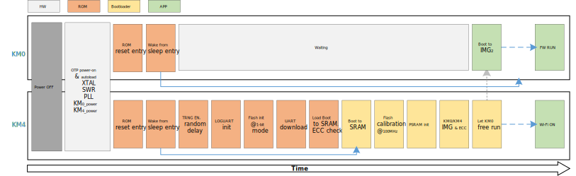

.. _boot_process:

Features
----------------
- On-chip boot ROM

- Contains the bootloader with In-System Programming (ISP) facility

- Secure boot process with multiple cryptographic algorithms of hardware or software engine

- Suspend resume process

- Boot from NOR flash

- PSRAM as a memory

Boot Address
------------------------
After reset, CPU will boot from the vector table start address, which is fixed by hardware. Both KM4 and KM0 boot from address ``0x0000_0000``.

.. table:: Boot address
   :width: 100%
   :widths: auto

   +-----+-------------+--------------+
   | CPU | Address     | Type         |
   +=====+=============+==============+
   | KM4 | 0x0000_0000 | KM4 ITCM ROM |
   +-----+-------------+--------------+
   | KM0 | 0x0000_0000 | KM0 ITCM ROM |
   +-----+-------------+--------------+

Pin Description
------------------------------
The |CHIP_NAME| supports ISP via LOGUART (``PB4`` and ``PB5``). The ISP mode is determined by the state of ``PB5`` when boot.

.. table:: ISP mode
   :width: 100%
   :widths: auto

   +-----------+---------------------+-------------------------------------------------+
   | Boot Mode | PB5 (UART_DOWNLOAD) | Description                                     |
   +===========+=====================+=================================================+
   | No ISP    | HIGH                | ISP bypassed. Part attempts to boot from Flash. |
   +-----------+---------------------+-------------------------------------------------+
   | ISP       | LOW                 | Part enters ISP via LOGUART.                    |
   +-----------+---------------------+-------------------------------------------------+

Boot Flow
------------------
The boot flow of |CHIP_NAME| is illustrated below. After a power-up or hardware reset, the hardware will boot KM4 at 150MHz. The boot process is handled by the on-chip boot ROM and is always executed by the KM4. After the KM4 bootloader code, the KM4 will set up the environment for the KM0.

- KM4 boots ROM

- KM4 secure boot (optional)

- KM4 boots to SRAM

- KM4 helps KM0 load images and check the signature (optional)

   Boot flow

The immutable ROM provides ISP service, which could be initial programming of a blank device, erasing and re-programming of a previously programmed device.

When the rising edge on RESET pin is generated, the trap pin (``PB5``) will be sampled to determine whether to continue the boot process or ISP service. If the trap pin is sampled LOW, the external hardware requests to start the ISP service. Otherwise, the chip boots normally.

Boot API
----------------
The boot API is used to obtain the cause of the chip boot, and the function prototype is:

.. code::

   u32 BOOT_Reason(void);

The default return value of this API is ``0`` when initially powered on, and return value of re-boot caused by other reasons can be found in the following table. Users can found macro-definitions about return value in file \ ``sysreg_aon.h``\ .

.. table::
   :width: 100%
   :widths: auto

   +--------------+---------------------------------------------------------------------+
   | Items        | Description                                                         |
   +==============+=====================================================================+
   | Introduction | Get boot reason                                                     |
   +--------------+---------------------------------------------------------------------+
   | Parameters   | None                                                                |
   +--------------+---------------------------------------------------------------------+
   | Return       | Boot reason. It can be any of the following values or combinations: |
   |              |                                                                     |
   |              | - AON_BIT_RSTF_OCP: Enter deep-sleep mode when OCP happens          |
   |              |                                                                     |
   |              | - AON_BIT_RSTF_KM0_SYS: KM0 system reset                            |
   |              |                                                                     |
   |              | - AON_BIT_RSTF_KM4_SYS: KM4 system reset                            |
   |              |                                                                     |
   |              | - AON_BIT_RSTF_IWDG: KM0 independent watchdog reset                 |
   |              |                                                                     |
   |              | - AON_BIT_RSTF_WDG0: KM0 watchdog reset                             |
   |              |                                                                     |
   |              | - AON_BIT_RSTF_WDG1: KM4 secure watchdog reset                      |
   |              |                                                                     |
   |              | - AON_BIT_RSTF_WDG2: KM4 non-secure watchdog reset                  |
   |              |                                                                     |
   |              | - AON_BIT_RSTF_WARM_KM42PERI: KM4 warm reset                        |
   |              |                                                                     |
   |              | - AON_BIT_RSTF_WARM_KM02PERI: KM0 warm reset                        |
   |              |                                                                     |
   |              | - AON_BIT_RSTF_DSLP: Wakeup from deep-sleep mode                    |
   |              |                                                                     |
   |              | - AON_BIT_RSTF_BOR: BOR Reset                                       |
   +--------------+---------------------------------------------------------------------+

