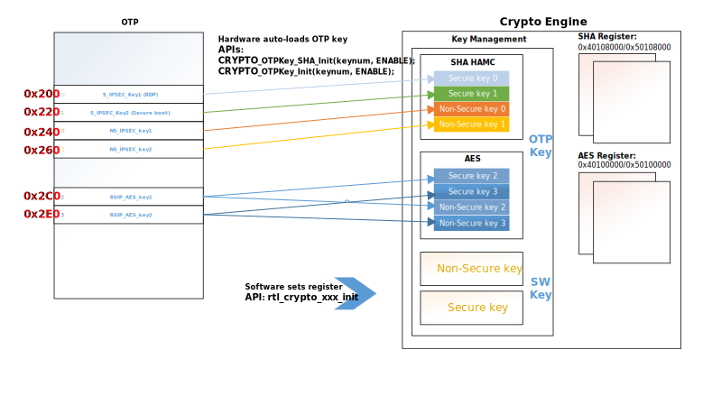

.. _hardware_crypto_engine:

Introduction
------------------------
The Hardware Crypto Engine (also called IPsec) accelerates applications that need cryptographic functions, such as authentication, encryption and decryption. Hardware crypto engine executing these functions cannot only reduce software overhead but also save CPU and memory resources, and the processing of it is more secure and faster than software. The key pair can be passed in by software or automatically loaded from OTP by hardware without software access the key.

OTP Keys for Crypto
~~~~~~~~~~~~~~~~~~~~~~~~~~~~~~~~~~~~~~~~~~~~~~~~~~~~~~~~~~~~~~~~~~~~
Crypto engine loads the secret key in two ways: one is that the user passes the secret key into the engine (software accessible key), the other way is that Crypto automatically loads keys from OTP (software inaccessible key).

OTP physical map can store six keys for Crypto to use as secret keys, which can only be accessed by crypto engine and will not be tampered with or read by attackers. The premise is that the secret key needs to be programmed into OTP physical map.

Among these six keys, there are two secure keys and two non-secure keys available for SHA HAMC to choose from, and four secure keys and non-secure keys available for AES to choose from. Refer to the table below for specific information.

.. table::
   :width: 100%
   :widths: auto

   +----------+-------------+-----------+---------------+
   | Engine   | Engine type | Key index | OTP key       |
   +==========+=============+===========+===============+
   | SHA HAMC | Secure      | 0         | S_IPSEC_Key1  |
   +----------+-------------+-----------+---------------+
   | SHA HAMC | Secure      | 1         | S_IPSEC_Key2  |
   +----------+-------------+-----------+---------------+
   | SHA HAMC | Non-Secure  | 0         | NS_IPSEC_Key1 |
   +----------+-------------+-----------+---------------+
   | SHA HAMC | Non-Secure  | 1         | NS_IPSEC_Key2 |
   +----------+-------------+-----------+---------------+
   | AES      | Secure      | 0         | S_IPSEC_Key1  |
   +----------+-------------+-----------+---------------+
   | AES      | Secure      | 1         | S_IPSEC_Key2  |
   +----------+-------------+-----------+---------------+
   | AES      | Secure      | 2         | RSIP_AES_key1 |
   +----------+-------------+-----------+---------------+
   | AES      | Secure      | 3         | RSIP_AES_key2 |
   +----------+-------------+-----------+---------------+
   | AES      | Non-Secure  | 0         | NS_IPSEC_Key1 |
   +----------+-------------+-----------+---------------+
   | AES      | Non-Secure  | 1         | NS_IPSEC_Key2 |
   +----------+-------------+-----------+---------------+
   | AES      | Non-Secure  | 2         | RSIP_AES_key1 |
   +----------+-------------+-----------+---------------+
   | AES      |             | 3         | RSIP_AES_key2 |
   +----------+-------------+-----------+---------------+

The detailed functions of OTP key are as follows:

.. table::
   :width: 100%
   :widths: auto

   +--------------------------------+-----------------------+----------+----------------+----------------------------------------------------------------------------------------------------------------------------+
   | OTP key name                   | Address               | Size     | Default        | Description                                                                                                                |
   +================================+=======================+==========+================+============================================================================================================================+
   | S_IPSEC_Key1 (RDP)             | Logic Map 0x200       | 32 bytes | Each Byte 0xFF | Secure crypto engine will auto-load this key for HAMC or AES function when OTPKey_init function is enabled.                |
   +--------------------------------+-----------------------+----------+----------------+----------------------------------------------------------------------------------------------------------------------------+
   | S_IPSEC_Key2                   | Logic Map 0x220       | 32 bytes | Each Byte 0xFF | Secure crypto engine will auto-load this key for HAMC or AES function when OTPKey_init function is enabled.                |
   |                                |                       |          |                |                                                                                                                            |
   | (Secure boot HMAC)             |                       |          |                |                                                                                                                            |
   +--------------------------------+-----------------------+----------+----------------+----------------------------------------------------------------------------------------------------------------------------+
   | NS_IPSEC_Key1                  | Logic Map 0x240       | 32 bytes | Each Byte 0xFF | Non-Secure crypto engine will auto-load this key for HAMC or AES function when OTPKey_init function is enabled.            |
   +--------------------------------+-----------------------+----------+----------------+----------------------------------------------------------------------------------------------------------------------------+
   | NS_IPSEC_Key2                  | Logic Map 0x260       | 32 bytes | Each Byte 0xFF | Non-Secure crypto engine will auto-load this key for HAMC or AES function when OTPKey_init function is enabled.            |
   +--------------------------------+-----------------------+----------+----------------+----------------------------------------------------------------------------------------------------------------------------+
   | RSIP_AES_key1                  | Logic Map 0x2c0       | 32 bytes | Each Byte 0xFF | Non-Secure AES engine and secure AES engine will auto-load this key for AES function when OTPKey_init function is enabled. |
   +--------------------------------+-----------------------+----------+----------------+----------------------------------------------------------------------------------------------------------------------------+
   | RSIP_AES_key2                  | Logic Map 0x2e0       | 32 bytes | Each Byte 0xFF | Non-Secure AES engine and secure AES engine will auto-load this key for AES function when OTPKey_init function is enabled. |
   +--------------------------------+-----------------------+----------+----------------+----------------------------------------------------------------------------------------------------------------------------+
   | S_IPSEC_Key1 Read Protection   | Physical Map 0x365[3] | 1 bit    | 1              | 0: Enable read protection for S_IPSEC_Key1 to prevent from being read out.                                                 |
   |                                |                       |          |                |                                                                                                                            |
   |                                |                       |          |                | 1: Disable read protection for S_IPSEC_Key1.                                                                               |
   +--------------------------------+-----------------------+----------+----------------+----------------------------------------------------------------------------------------------------------------------------+
   | S_IPSEC_Key1 Write Protection  | Physical Map 0x365[4] | 1 bit    | 1              | 0: Enable write protection for S_IPSEC_Key1 to prevent from being programmed to all 0 by hacker.                           |
   |                                |                       |          |                |                                                                                                                            |
   |                                |                       |          |                | 1: Disable write protection for S_IPSEC_Key1.                                                                              |
   +--------------------------------+-----------------------+----------+----------------+----------------------------------------------------------------------------------------------------------------------------+
   | S_IPSEC_Key2 Read Protection   | Physical Map 0x365[5] | 1 bit    | 1              | 0: Enable read protection for S_IPSEC_Key2 to prevent from being read out.                                                 |
   |                                |                       |          |                |                                                                                                                            |
   |                                |                       |          |                | 1: Disable read protection for S_IPSEC_Key2.                                                                               |
   +--------------------------------+-----------------------+----------+----------------+----------------------------------------------------------------------------------------------------------------------------+
   | S_IPSEC_Key2 Write Protection  | Physical Map 0x365[6] | 1 bit    | 1              | 0: Enable write protection for S_IPSEC_Key2 to prevent from being programmed to all 0 by hacker.                           |
   |                                |                       |          |                |                                                                                                                            |
   |                                |                       |          |                | 1: Disable write protection for S_IPSEC_Key2.                                                                              |
   +--------------------------------+-----------------------+----------+----------------+----------------------------------------------------------------------------------------------------------------------------+
   | NS_IPSEC_Key1 Read Protection  | Physical Map 0x365[7] | 1 bit    | 1              | 0: Enable read protection for NS_IPSEC_Key1 to prevent from being read out.                                                |
   |                                |                       |          |                |                                                                                                                            |
   |                                |                       |          |                | 1: Disable read protection for NS_SHA_Key1.                                                                                |
   +--------------------------------+-----------------------+----------+----------------+----------------------------------------------------------------------------------------------------------------------------+
   | NS_IPSEC_Key1 Write Protection | Physical Map 0x366[0] | 1 bit    | 1              | 0: Enable write protection for NS_IPSEC_Key1 to prevent from being programmed to all 0 by hacker.                          |
   |                                |                       |          |                |                                                                                                                            |
   |                                |                       |          |                | 1: Disable write protection for NS_IPSEC_Key1.                                                                             |
   +--------------------------------+-----------------------+----------+----------------+----------------------------------------------------------------------------------------------------------------------------+
   | NS_IPSEC_Key2 Read Protection  | Physical Map 0x366[1] | 1 bit    | 1              | 0: Enable read protection for NS_IPSEC_Key2 to prevent from being read out.                                                |
   |                                |                       |          |                |                                                                                                                            |
   |                                |                       |          |                | 1: Disable read protection for NS_IPSEC_Key2.                                                                              |
   +--------------------------------+-----------------------+----------+----------------+----------------------------------------------------------------------------------------------------------------------------+
   | NS_IPSEC_Key2 Write Protection | Physical Map 0x366[2] | 1 bit    | 1              | 0: Enable write protection for NS_IPSEC_Key2 to prevent from being programmed to all 0 by hacker.                          |
   |                                |                       |          |                |                                                                                                                            |
   |                                |                       |          |                | 1: Disable write protection for NS_IPSEC_Key2.                                                                             |
   +--------------------------------+-----------------------+----------+----------------+----------------------------------------------------------------------------------------------------------------------------+
   | RSIP_AES_Key1 Read Protection  | Physical Map 0x366[7] | 1 bit    | 1              | 0: Enable read protection for RSIP_AES_Key1 to prevent from being read out.                                                |
   |                                |                       |          |                |                                                                                                                            |
   |                                |                       |          |                | 1: Disable read protection for RSIP_AES_Key1.                                                                              |
   +--------------------------------+-----------------------+----------+----------------+----------------------------------------------------------------------------------------------------------------------------+
   | RSIP_AES_Key1 Write Protection | Physical Map 0x367[0] | 1 bit    | 1              | 0: Enable write protection for RSIP_AES_Key1 to prevent from being programmed to all 0 by hacker.                          |
   |                                |                       |          |                |                                                                                                                            |
   |                                |                       |          |                | 1: Disable write protection for RSIP_AES_Key1.                                                                             |
   +--------------------------------+-----------------------+----------+----------------+----------------------------------------------------------------------------------------------------------------------------+
   | RSIP_AES_Key2 Read Protection  | Physical Map 0x367[1] | 1 bit    | 1              | 0: Enable read protection for RSIP_AES_Key2 to prevent from being read out.                                                |
   |                                |                       |          |                |                                                                                                                            |
   |                                |                       |          |                | 1: Disable read protection for RSIP_AES_Key2.                                                                              |
   +--------------------------------+-----------------------+----------+----------------+----------------------------------------------------------------------------------------------------------------------------+
   | RSIP_AES_Key2 Write Protection | Physical Map 0x367[2] | 1 bit    | 1              | 0: Enable write protection for RSIP_AES_Key2 to prevent from being programmed to all 0 by hacker.                          |
   |                                |                       |          |                |                                                                                                                            |
   |                                |                       |          |                | 1: Disable write protection for RSIP_AES_Key2.                                                                             |
   +--------------------------------+-----------------------+----------+----------------+----------------------------------------------------------------------------------------------------------------------------+

Crypto Key Order
~~~~~~~~~~~~~~~~~~~~~~~~~~~~~~~~
The key order for Crypto Engine is the same with mbedtls, it uses little endian mode. For example, if the key is:

.. code-block::

   0x0123456789abcdef0123456789abcdef00112233445566778899aabbccddeeff

When the key is put in an array and pass to HW engine using RTK API or mbedtls API, the array should like:

.. code-block::

   u8 key1[32]={
   0xff, 0xee, 0xdd, 0xcc, 0xbb, 0xaa, 0x99, 0x88, 0x77, 0x66, 0x55, 0x44, 0x33, 0x22, 0x11, 0x00,
   0xef, 0xcd, 0xab, 0x89, 0x67, 0x45, 0x23, 0x01, 0xef, 0xcd, 0xab, 0x89, 0x67, 0x45, 0x23, 0x01
   };

When program the key into OTP, customer should use the following commands, Take NS_SHA_key2 as an example:

.. code-block::

   Efuse wraw 0x260 20 ffeeddccbbaa99887766554433221100efcdab8967452301efcdab8967452301

The contents in OTP is:

.. list-table::
   :stub-columns: 1

   * - 0x260
     - ff
     - ee
     - dd
     - cc
     - bb
     - aa
     - 99
     - 88
     - 77
     - 66
     - 55
     - 44
     - 33
     - 22
     - 11
     - 00
   * - 0x270
     - ef
     - cd
     - ab
     - 89
     - 67
     - 45
     - 23
     - 01
     - ef
     - cd
     - ab
     - 89
     - 67
     - 45
     - 23
     - 01

Crypto Key Flash Procedure
~~~~~~~~~~~~~~~~~~~~~~~~~~~~~~~~~~~~~~~~~~~~~~~~~~~~
The process of programming OTP physical map is as follows:

1. Generate the key.

2. Write into OTP physical map by command ``Efuse wraw <address> <length> <data>``

   .. code-block::

      Efuse wraw 0x260 20 0123456789abcdef0123456789abcdef00112233445566778899aabbccddeeff

3. Use the following command to read OTP key back to check if it is written correctly. If not, re-write it.

   .. code-block::

      Efuse rraw

4. Enable Key Read Protection and Write Protection to prevent key exposure and tampering after the written IPSEC Key is confirmed.

   .. code-block::

      Efuse wraw 0x366 1 f9

.. note::
   After read protection and write protection are programmed, the key can never be read out again. Please maintain the key pair carefully.

Usage
----------
Initializing Hardware Crypto Engine
~~~~~~~~~~~~~~~~~~~~~~~~~~~~~~~~~~~~~~~~~~~~~~~~~~~~~~~~~~~~~~~~~~~~~~
Call initialization APIs to initialize the engine before using and any calculation.

.. note::
   The power of the engine will be turn off when the system enters low power status, so the settings will be rested .A new round initialization is suggested during resume.

Using Auto-loaded OTP Key from OTP
~~~~~~~~~~~~~~~~~~~~~~~~~~~~~~~~~~~~~~~~~~~~~~~~~~~~~~~~~~~~~~~~~~~~
1. Initialize AES OTP key function:

   .. code-block:: c

      CRYPTO_OTPKey_Init(keynum, ENABLE);

2. Initialize HMAC OTP key function:

   .. code-block:: c

      CRYPTO_OTPKey_SHA_Init(keynum, ENABLE);

Starting Crypto Engine Calculation
~~~~~~~~~~~~~~~~~~~~~~~~~~~~~~~~~~~~~~~~~~~~~~~~~~~~~~~~~~~~~~~~~~~~
Choose a hash or cipher algorithm, and call the following APIs to calculate the hash digest or cipher text.

Hash Algorithm
^^^^^^^^^^^^^^^^^^^^^^^^^^^^

If a hash algorithm is selected, and the message length doesn’t exceed 245745 (=15 * (214 -1)) bytes, Hash APIs ``rtl_crypto_xxx`` can be used to calculate the digest. If the message length exceeds 245745 bytes or you want to divide this message into many particular size blocks to process them, you could use ``Sequential Hash Mechanism`` to verify the hash function.

Sequential hash breaks a whole long message into several piece of message payload, then calculate the payload in sequence, until the last message payload.

When using sequential hash, follow the steps below:

1. Initialize sequential hash: use Hash APIs ``rtl_crypto_xxx_init`` to initialize.

2. Handle each piece of message payload: call Hash APIs ``rtl_crypto_xxx_update`` once when one piece message payload.

3. Handle the last piece of message payload: call Hash APIs ``rtl_crypto_xxx_final`` once when one piece message payload.

.. note::
      - Considering that the crypto engine moves data through DMA and bypasses the D-Cache, if the destination array is placed in stack and the start address is not 32-byte aligned, the cache line would be dirty during function call in some cases. To avoid reading wrong digest back, users should choose one of the following methods:

         - The digest array is a global variable.

         - Or the start address of digest array should be 32-byte aligned if it’s a local variable.

         - Or call the following line to restore data from memory before reading digest when calculation is finished if it’s a local variable.

      .. code-block:: c

         DCache_Invalidate(((u32)digest&CACHE_LINE_ADDR_MSK),(sizeof(digest)+CACHE_LINE_SIZE));

      - After KM4 power gating, IPsec needs to be initialized again to work normally.

      - To prevent errors caused by multi-core access to crypto simultaneously, a lock is added before ``CRYPTO_OTPKey_Init``, and the lock is released after crypto calculation.

      .. code-block:: c

         /*take sema to obtain the right to crypto engine*/
         {
         while (IPC_SEMTake(IPC_SEM_CRYPTO, timeout) != _TRUE);
         CRYPTO_OTPKey_SHA_Init(keynum, status);
         rtl_crypto_hmac_sha2_update(u8 *message, IN u32 msglen, hw_sha_context *ctx);
         ...
         rtl_crypto_hmac_sha2_final(u8 *pDigest, hw_sha_context *ctx);
         
         /*free sema to release the right to crypto engine*/
         IPC_SEMFree(IPC_SEM_CRYPTO);
         }

Cipher Algorithm
^^^^^^^^^^^^^^^^^^^^^^^^^^^^^^^^
Steps to encrypt or decrypt message are as follows:

1. Call Cipher APIs ``rtl_crypto_aes_xxx_init`` to initialize

2. Encrypt or decrypt the message

   - Call Cipher APIs ``rtl_crypto_aes_xxx_encrypt`` to encrypt source message.

   - Call Cipher APIs ``rtl_crypto_aes_xxx_decrypt`` to decrypt source message.

.. note::
      - To prevent errors caused by multi-core access to crypto simultaneously, a lock is added before ``CRYPTO_OTPKey_Init``, and the lock is released after ``rtl_crypto_aes_xxx_encrypt`` or ``rtl_crypto_aes_xxx_decrypt``.

   .. code-block:: c

      /*take sema to obtain the right to crypto engine*/
      while (IPC_SEMTake(IPC_SEM_CRYPTO, timeout) != _TRUE);
      CRYPTO_OTPKey_Init(keynum, status);
      rtl_crypto_aes_xxx_encrypt(message, msglen, pIv, ivlen, pResult);
      /*free sema to release the right to crypto engine*/
      IPC_SEMFree(IPC_SEM_CRYPTO);
      /*take sema to obtain the right to crypto engine*/
      while (IPC_SEMTake(IPC_SEM_CRYPTO, timeout) != _TRUE);
         CRYPTO_OTPKey_Init(keynum, status);
         rtl_crypto_aes_xxx_decrypt(message, msglen, pIv, ivlen, pResult);
      /*free sema to release the right to crypto engine*/
      IPC_SEMFree(IPC_SEM_CRYPTO);

Demo Code
------------------
The demo code of hardware crypto engine locates at  ``{SDK}\component\example\peripheral\raw\Crypto`` .

