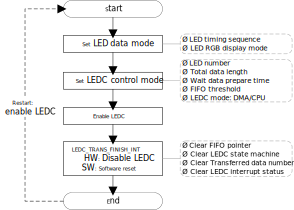

.. _ledc:

Introduction
------------------------
The LEDC is used to drive external smart LEDs, like *WS2812B*.
The LEDC supports DMA mode and interrupt mode, with 32 * 24 bits LEDC FIFO, and also supports RGB888 display mode and configurable refresh time.

LEDC Control Application
------------------------------------------------
Taking *WS2812C-2020* LED for example, before using this LED, we have to configure the logical character ``0`` and character ``1`` according to the LEDC data input code of typical LED datasheet, as shown below.

.. table::
   :width: 100%
   :widths: auto

   +---------------+---------------------------------+------------+------+
   | Modulate code | Description                     | Time range | Unit |
   +===============+=================================+============+======+
   | T0H           | Digital 0 code, high-level time | 220 ~ 380  | ns   |
   +---------------+---------------------------------+------------+------+
   | T0L           | Digital 0 code, low-level time  | 580 ~ 1000 | ns   |
   +---------------+---------------------------------+------------+------+
   | T1H           | Digital 1 code, high-level time | 580 ~ 1000 | ns   |
   +---------------+---------------------------------+------------+------+
   | T1L           | Digital 1 code, low-level time  | 220 ~ 420  | ns   |
   +---------------+---------------------------------+------------+------+
   | RESET         | Frame unit, low-level time      | > 280      | μs   |
   +---------------+---------------------------------+------------+------+

Logical ``0`` coding time is T0-code: 800ns ~ 1980ns, and logical ``1`` coding time is T1-code: 800ns ~ 2020ns.

The supported LED number is：

.. math::
   :nowrap:

   \begin{gather*}
   LED\_NUM = \frac{\frac{1}{LED\,fresh\,rate(\frac{frame}{s})} - 280μs}{(logical\,0\,or\,1\,coding\,time) * 24}
   \end{gather*}

- When LED's refresh rate is 30 frames/s, the supported LED number is 681 to 1023.

- When LED's refresh rate is 60 frames/s, the supported LED number is 337 to 853.

The related registers of LED setting are *LED_T0&T1_TIMING_CTRL_REG*, *LEDC_DATA_FINISH_CNT_REG*, *LED_RESET_TIMING_CTRL_REG*, *LEDC_WAIT_TIME_CTRL_REG*, *LEDC_DMA_CTRL_REG*, and *LEDC_INTERRUPT_CTRL_REG*.

The WS2812 serious LED data transfer protocol uses a single NRZ (non-return zero) communication mode.
After the LED power-on reset, the DI port receives data from the controller, the first LED collects initial 24-bit data then sends 24-bit data to the internal data latch, 
the other data reshaping by the internal signal reshaping amplification circuit sent to the next cascade pixel through the DO port. After transmission of each pixel, 
the signal reduces 24 bits. Pixel adopts auto reshaping transmit technology, making the pixel cascade number is not limited by the signal transmission, only depending on the speed of signal transmission.

Operation Flow
----------------------------
The flow of LEDC normal configuration process is shown below.

.. _ledc_operation_flow_step_1:

1. Configure LEDC data mode through *LED_RGB_MODE* field, *LED_MSB_TOP* bit, *LED_MSB_BYTE2* bit, *LED_MSB_BYTE1* bit and *LED_MSB_BYTE0* bit in the *LEDC_CTRL_REG* register.

2. Configure LEDC control mode through the registers: *LED_T01_TIMING_CTRL_REG*, *LEDC_DATA_FINISH_CNT_REG*, *LED_RESET_TIMING_CTRL_REG*, *LEDC_WAIT_TIME0_CTRL_REG*, *LEDC_WAIT_TIME1_CTRL_REG*, *LEDC_DMA_CTRL_REG* and *LEDC_INTERRUPT_CTRL_REG*.

3. Enable the LEDC by writing 1 to the LEDC_EN bit in *LEDC_CTRL_REG* register.

4. If *LEDC_DMA_EN* bit in *LEDC_DMA_CTRL_REG* register is set to 1, go to :ref:`Step 5 <ledc_operation_flow_step_5>`. If not, go to :ref:`Step 7 <ledc_operation_flow_step_7>`.

.. _ledc_operation_flow_step_5:

5. The LEDC sends *dma_req* to DMAC.

6. The DMAC transfers data from memory to LEDC FIFO by APB bus and sends dma_ack signal following the last data. Go to :ref:`Step 8 <ledc_operation_flow_step_8>`.

.. _ledc_operation_flow_step_7:

7. The LEDC sends CPU_REQ_INT signal to CPU. DMAC is required to transfer data from memory to LEDC. Go to :ref:`Step 8 <ledc_operation_flow_step_8>`.

.. _ledc_operation_flow_step_8:

8. The LEDC transfers data from LEDC FIFO to LED lamps.

9. When *LED_DATA_FINISH_CNT* field in *LEDC_DATA_FINISH_CNT_REG* register equals *TOTAL_DATA_LENGTH* which is set in *LEDC_CTRL_REG* register, *LED_TRANS_FINISH_INT* interrupt is generated, and hardware resets LEDC_EN to 0.

10. Clear *LED_TRANS_FINISH_INT* interrupt by software.

11. It is suggested that asserting *LEDC_SOFT_RESET* bit in *LEDC_CTRL_REG* register to clear all interrupt status registers.

12. If software wants to scan LED lamps again, go to :ref:`Step 1 <ledc_operation_flow_step_1>`.

   LEDC normal configuration process

.. note:: For more details, refer to the document of mbed APIs.
