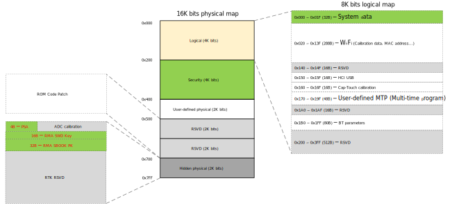
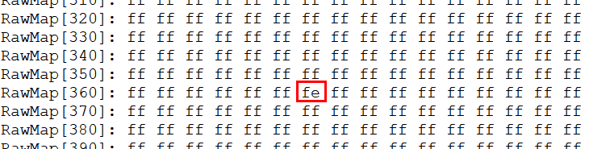
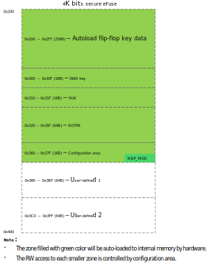

.. _otpc:

Introduction
------------------------

Antifuse one-time programmable (OTP) is the most secure embedded non-volatile memory (eNVM). The default value is *1* and can only be change from *1* to *0*.

   OTP Layout

.. note:: For detailed layout of each OTP zone, refer to UM1000.
   

OTP Programming APIs
----------------------------------------
.. table::
   :width: 100%
   :widths: auto

   +----------------------+------------------------------------------------------+----------------+
   | API                  | Description                                          | Operation zone |
   +======================+======================================================+================+
   | OTP_Read8            | Read OTP physical zone one byte                      | Physical zone  |
   +----------------------+------------------------------------------------------+----------------+
   | OTP_Write8           | Write OTP physical zone one byte                     | Physical zone  |
   +----------------------+------------------------------------------------------+----------------+
   | OTP_LogicalMap_Read  | Read OTP logical zone by length                      | Logical zone   |
   +----------------------+------------------------------------------------------+----------------+
   | OTP_LogicalMap_Write | Write OTP logical address by length                  | Logical zone   |
   +----------------------+------------------------------------------------------+----------------+
   | OTP_RemainLength     | Get OTP remain available length used for logical map | Logical zone   |
   +----------------------+------------------------------------------------------+----------------+
   | OTPGetCRC            | Get the CRC of security area                         | Physical zone  |
   +----------------------+------------------------------------------------------+----------------+

OTP_Read8
~~~~~~~~~~~~~~~~~~
.. table::
   :width: 100%
   :widths: auto

   +--------------+------------------------------------------------+
   | Items        | Description                                    |
   +==============+================================================+
   | Introduction | Read OTP physical zone one byte                |
   +--------------+------------------------------------------------+
   | Parameters   | - Addr: OTP physical zone address to be read   |
   |              |                                                |
   |              | - Data: one byte data buffer for OTP data read |
   +--------------+------------------------------------------------+
   | Return       | Result of read operation                       |
   |              |                                                |
   |              | - 1: SUCCESS                                   |
   |              |                                                |
   |              | - 0: FAIL                                      |
   +--------------+------------------------------------------------+

OTP_Write8
~~~~~~~~~~~~~~~~~~~~
.. table::
   :width: 100%
   :widths: auto

   +--------------+-------------------------------------------------+
   | Items        | Description                                     |
   +==============+=================================================+
   | Introduction | Write OTP physical zone one byte                |
   +--------------+-------------------------------------------------+
   | Parameters   | - Addr: OTP physical zone address to be written |
   |              |                                                 |
   |              | - Data: one byte data to be written             |
   +--------------+-------------------------------------------------+
   | Return       | Result of write operation                       |
   |              |                                                 |
   |              | - 1: SUCCESS                                    |
   |              |                                                 |
   |              | - 0: FAIL                                       |
   +--------------+-------------------------------------------------+

OTP_LogicalMap_Read
~~~~~~~~~~~~~~~~~~~~~~~~~~~~~~~~~~~~~~
.. table::
   :width: 100%
   :widths: auto

   +--------------+---------------------------------------------------+
   | Items        | Description                                       |
   +==============+===================================================+
   | Introduction | Read OTP logical map                              |
   +--------------+---------------------------------------------------+
   | Parameters   | - pbuf: buffer used for OTP logical map           |
   |              |                                                   |
   |              | - addr: OTP logical zone start address to be read |
   |              |                                                   |
   |              | - len: OTP logical zone byte length to be read    |
   +--------------+---------------------------------------------------+
   | Return       | Result of read operation                          |
   |              |                                                   |
   |              | - 1: SUCCESS                                      |
   |              |                                                   |
   |              | - 0: FAIL                                         |
   +--------------+---------------------------------------------------+

OTP_LogicalMap_Write
~~~~~~~~~~~~~~~~~~~~~~~~~~~~~~~~~~~~~~~~
.. table::
   :width: 100%
   :widths: auto

   +--------------+------------------------------------------------------+
   | Items        | Description                                          |
   +==============+======================================================+
   | Introduction | Write OTP logical address by length                  |
   +--------------+------------------------------------------------------+
   | Parameters   | - addr: OTP logical zone start address to be written |
   |              |                                                      |
   |              | - cnts: OTP logical byte length to be written        |
   |              |                                                      |
   |              | - data: data buffer to be write                      |
   +--------------+------------------------------------------------------+
   | Return       | Result of write operation                            |
   |              |                                                      |
   |              | - 1: SUCCESS                                         |
   |              |                                                      |
   |              | - 0: FAIL                                            |
   +--------------+------------------------------------------------------+

OTP_RemainLength
~~~~~~~~~~~~~~~~~~~~~~~~~~~~~~~~
.. table::
   :width: 100%
   :widths: auto

   +--------------+------------------------------------------------------+
   | Items        | Description                                          |
   +==============+======================================================+
   | Introduction | Get OTP remain available length used for logical map |
   +--------------+------------------------------------------------------+
   | Parameters   | None                                                 |
   +--------------+------------------------------------------------------+
   | Return       | Remain available length                              |
   +--------------+------------------------------------------------------+

OTPGetCRC
~~~~~~~~~~~~~~~~~~
.. table::
   :width: 100%
   :widths: auto

   +--------------+------------------------------------+
   | Items        | Description                        |
   +==============+====================================+
   | Introduction | Get the CRC value of security area |
   +--------------+------------------------------------+
   | Parameters   | None                               |
   +--------------+------------------------------------+
   | Return       | CRC value                          |
   +--------------+------------------------------------+

OTP Programming Commands
------------------------------------------------
You can access OTP by the following commands from serial port.

.. _otpc_logical_zone:

Logical Zone
~~~~~~~~~~~~~~~~~~~~~~~~
You can read and write the logical zone by commands listed below.

.. table::
   :width: 60%
   :widths: auto

   +-----------+--------------------------------------+-----------------------------------------------------------+
   | Operation | Command                              | Description                                               |
   +===========+======================================+===========================================================+
   | Read      | EFUSE rmap                           | Read the whole logical zone.                              |
   +-----------+--------------------------------------+-----------------------------------------------------------+
   | Write     | EFUSE wmap <address> <length> <data> | Write to specific address of logical zone.                |
   |           |                                      |                                                           |
   |           |                                      | - address: start logical address to be written to, in hex |
   |           |                                      |                                                           |
   |           |                                      | - length: bytes of data needed to be written, in hex      |
   |           |                                      |                                                           |
   |           |                                      | - data: data to be written, in hex                        |
   |           |                                      |                                                           |
   |           |                                      | .. note::                                                 |
   |           |                                      |    The string length of data to be written must be even.  |
   +-----------+--------------------------------------+-----------------------------------------------------------+

For example:

- By command ``EFUSE wmap 0 2 3087``, you can write 0x3087 that is 2 bytes into logical address 0x0.

- By command ``EFUSE rmap``, the logical zone is all shown immediately.

.. figure:: ../figures/efuse_write_and_read_logical_map.png
   :scale: 60%
   :align: center
   :name: efuse_write_and_read_logical_map

In the massive production (MP) stage, another command to program logical zone is "iwpriv", which has been integrated into RF calibration tools. This command is only recommended to be used to program Wi-Fi calibration zone.

Physical Zone
~~~~~~~~~~~~~~~~~~~~~~~~~~
You can read and write the physical zone by commands listed below. The value of physical zone can only be written from *1* to *0*, please program it carefully.

.. table::
   :width: 100%
   :widths: auto

   +-----------+--------------------------------------+------------------------------------------------------------+
   | Operation | Command                              | Description                                                |
   +===========+======================================+============================================================+
   | Read      | EFUSE rraw                           | Read the whole physical zone.                              |
   +-----------+--------------------------------------+------------------------------------------------------------+
   | Write     | EFUSE wraw <address> <length> <data> | Write to specific address of physical zone.                |
   |           |                                      |                                                            |
   |           |                                      | - address: start physical address to be written to, in hex |
   |           |                                      |                                                            |
   |           |                                      | - length: bytes of data needed to be written, in hex       |
   |           |                                      |                                                            |
   |           |                                      | - data: data to be written, in hex                         |
   |           |                                      |                                                            |
   |           |                                      |                                                            |
   |           |                                      |                                                            |
   |           |                                      | .. note::                                                  |
   |           |                                      |    The string length of data to be written must be even.   |
   +-----------+--------------------------------------+------------------------------------------------------------+

For example:

- By command ``FUSE wraw 366 1 FE``, you can write 0xFE that is 1 byte into physical address 0x366 to enable the ``NS_IPSEC_Key2_R_Forbidden_EN`` bit.

- By command ``EFUSE rraw``, the physical zone is all shown immediately.

.. figure:: ../figures/efuse_write_and_read_physical_map_upper_half.png
   :scale: 90%
   :align: center

.. centered::
   ...

In the MP stage, you can also use Wi-Fi command ``iwpriv`` as mentioned in section :ref:`Logical Zone <otpc_logical_zone>`.

Usage
----------
Logical Zone
~~~~~~~~~~~~~~~~~~~~~~~~
The OTP can only be programmed once, however some data needs to be overwritten in some reason.
Therefore, the logical data can be overwritten after format conversion defined by Realtek, as described in User Manual (Section: Mapping Relationship of Physical OTP and Logical OTP).

The logical zone can be programmed multi-times, in case the remain length of physical zone 0x0~0x1FF is enough.

.. note:: The logical zone is programmed in bytes instead of bits. Therefore, to avoid writing incorrectly that would cause wasting the physical zone for logical mapping, you should read logical map to check the original value before programming new value.

System Data
^^^^^^^^^^^^^^^^^^^^^^
The logical area 0x000 ~ 0x01F (32 bytes) will be auto-loaded to system registers by hardware when the system boots. If the system data hasn't been programmed, system registers keep initial value that are 0x00, however reading logical map will get 0xFF.

The procedure of programming the system data is described below.

   Programming the system data

About the target address that you want to program, there're two cases:

- One is that the system data in the target address has been programmed before. In this case, you can refer to :ref:`Example 1 <otpc_system_data_example_1>`.

- The other is that the system data hasn't been programmed never. In this case, you can refer to :ref:`Example 2 <otpc_system_data_example_2>`.

.. note:: When programming the system data, the start address must be 4-byte aligned at 4-byte length.

.. _otpc_system_data_example_1:

Example 1
**********

Program the value of logical address 0x02[1] to 1, you should follow these steps:

.. _otpc_system_data_example_1_step_1:

1. Read the logical map to check the original value in logical address 0x00~0x03.

   .. code-block:: c

      efuse rmap

   Or

   .. code-block:: c
      
      u8 data_read[4];
      OTP_LogicalMap_Read(&data_read,0,4);

2. Assume the data is 0x12A03456 in logical address 0x00~0x03 in :ref:`Step 1 <otpc_system_data_example_1_step_1>`. Let 0xA0 makes 'OR' operation with programmed bit[1], and other data keeps default value. So the new value to be written is 0x12A23456.

3. Write the new value 0x12A23456 to logical address 0x00~0x03.

   .. code-block:: c
      
      efuse wmap 0 4 5634A212

   Or

   .. code-block:: c
      
      u8 data_written[4]={0x56,0x34,0xA2,0x12};
      OTP_LogicalMap_Write(0,4,(u8 *)data_written);

4. Read the data_written again to check whether the value is written correctly.

   .. code-block:: c
      
      efuse rmap

   Or

   .. code-block:: c
      
      u8 data_read[4];
      OTP_LogicalMap_Read(&data_read,0,4);

.. _otpc_system_data_example_2:

Example 2
**********

Program the value of logical address 0x08[0] to 1, you should follow following steps:

.. _otpc_system_data_example_2_step_1:

1. Read the logical map to check the original value.

   .. code-block:: c
   
      efuse rmap

   Or

   .. code-block:: c
   
      u8 data_read[4];
      OTP_LogicalMap_Read(&data_read,8,4);

2. Assume the data is 0xFFFFFFFF in logical address 0x08~0x0B in :ref:`Step 1 <otpc_system_data_example_2_step_1>`. Let 0x00 makes 'OR' operation with programmed bit[0], and other data keeps default value. So the new value to be written is 0x00000001.

3. Write the new value 0x00000001 to logical address 0x08~0x0B.

   .. code-block:: c
   
      efuse wmap 8 4 01000000

   Or

   .. code-block:: c
   
      u8 data_written[4]={0x01,0x00,0x00,0x00};
      OTP_LogicalMap_Write(8,4,(u8 *)data_written);

4. Read the data_written again to check whether the value is written correctly.

   .. code-block:: c
   
      efuse rmap

   Or

   .. code-block:: c
   
      u8 data_read[4];
      OTP_LogicalMap_Read(&data_read,8,4);

Wi-Fi Calibration Data
^^^^^^^^^^^^^^^^^^^^^^^^^^^^^^^^^^^^^^^^^^^^
For detailed information about Wi-Fi Calibration Data, refer to *WS_MP_FLOW.pdf*.

Programming Scenarios
^^^^^^^^^^^^^^^^^^^^^^^^^^^^^^^^^^^^^^^^^^
Usually, system data has their initial value, and you can program specific bits according to your demands. Table below lists some scenarios that specific bits need to be programmed at your requirements.

.. table::
   :width: 100%
   :widths: auto

   +--------+-----+--------------------+-----+---------------------------------------------+---------------------------------------------------------------------------------------+
   | Offset | Bit | Symbol             | INI | Description                                 | Scenarios                                                                             |
   +========+=====+====================+=====+=============================================+=======================================================================================+
   | 0x02   | [1] | SPIC_ADDR_4BYTE_EN | 0   | SPI Flash controller address 4-byte enable  | - If embedded Flash is used, ignore it.                                               |
   |        |     |                    |     |                                             |                                                                                       |
   |        |     |                    |     | 0: Disable                                  | - If external Flash is used, moreover, its size is larger than 16M bytes, program it. |
   |        |     |                    |     |                                             |                                                                                       |
   |        |     |                    |     | 1: Enable                                   |                                                                                       |
   +--------+-----+--------------------+-----+---------------------------------------------+---------------------------------------------------------------------------------------+
   | 0x03   | [1] | LOW_BAUD_LOG_EN    | 0   | LOGUART baud rate selection                 | If the LOGUART baud rate needs to be changed from 1.5Mbps to 115200bps, program it.   |
   |        |     |                    |     |                                             |                                                                                       |
   |        |     |                    |     | 0: 1.5Mbps                                  |                                                                                       |
   |        |     |                    |     |                                             |                                                                                       |
   |        |     |                    |     | 1: 115200bps                                |                                                                                       |
   +--------+-----+--------------------+-----+---------------------------------------------+---------------------------------------------------------------------------------------+
   | 0x03   | [0] | DIS_BOOT_LOG_EN    | 0   | Boot ROM log disable                        | If boot ROM log needs to be disabled, program it.                                     |
   |        |     |                    |     |                                             |                                                                                       |
   |        |     |                    |     | 0: Enable                                   |                                                                                       |
   |        |     |                    |     |                                             |                                                                                       |
   |        |     |                    |     | 1: Disable                                  |                                                                                       |
   +--------+-----+--------------------+-----+---------------------------------------------+---------------------------------------------------------------------------------------+

Security Zone
~~~~~~~~~~~~~~~~~~~~~~~~~~
The security zone is divided into three parts, as illustrated below.

- Key area: 0x200~0x35F

- Configuration area: 0x360~0x37F

- User-defined area: 0x380~0x3FF

   Security area layout

Key Area
^^^^^^^^^^^^^^^^^^^^^^^^^^^^^^^^^^^^^^^^^^^^^^
Contents in key area are listed below. For more detailed usage about the keys, refer to the corresponding chapters.
   
.. table::
   :width: 100%
   :widths: auto
   
   +-------------+--------------------+-------------+--------------+------------+-------------------------------------------------------+
   | Function    | Name               | Size (bits) | Start offset | End offset | Usage                                                 |
   +=============+====================+=============+==============+============+=======================================================+
   | IPSEC       | S_IPSEC_Key1 (RDP) | 256         | 0x200        | 0x021F     | :ref:`Hardware Crypto Engine <hardware_crypto_engine>`|
   +-------------+--------------------+-------------+--------------+------------+                                                       |
   | IPSEC       | S_IPSEC_Key2       | 256         | 0x220        | 0x023F     |                                                       |
   |             |                    |             |              |            |                                                       |
   |             | (Secure boot HMAC) |             |              |            |                                                       |
   +-------------+--------------------+-------------+--------------+------------+                                                       |
   | IPSEC       | NS_IPSEC_Key1      | 256         | 0x240        | 0x025F     |                                                       |
   +-------------+--------------------+-------------+--------------+------------+                                                       |
   | IPSEC       | NS_IPSEC_Key2      | 256         | 0x260        | 0x027F     |                                                       |
   +-------------+--------------------+-------------+--------------+------------+-------------------------------------------------------+
   | USER PRI    | USER_PRI_KEY1      | 256         | 0x280        | 0x029F     |                                                       |
   +-------------+--------------------+-------------+--------------+------------+                                                       |
   | USER PRI    | USER_PRI_KEY2      | 256         | 0x2A0        | 0x02BF     |                                                       |
   +-------------+--------------------+-------------+--------------+------------+-------------------------------------------------------+
   | RSIP        | RSIP_KEY1          | 256         | 0x2C0        | 0x02DF     | :ref:`Secure Image Protection <rsip>`                 |
   +-------------+--------------------+-------------+--------------+------------+                                                       |
   | RSIP        | RSIP_KEY2          | 256         | 0x2E0        | 0x02FF     |                                                       |
   +-------------+--------------------+-------------+--------------+------------+-------------------------------------------------------+
   | SWD         | SWD_PASSWORD       | 128         | 0x300        | 0x030F     | :ref:`SWD Protection <swd_protection>`                |
   +-------------+--------------------+-------------+--------------+------------+-------------------------------------------------------+
   | PSA         | HUK                | 128         | 0x310        | 0x031F     | :ref:`HUK Derivation <huk_derivation>`                |
   +-------------+--------------------+-------------+--------------+------------+-------------------------------------------------------+
   | Secure Boot | PK1 (ROTPK hash)   | 256         | 0x320        | 0x033F     | :ref:`Secure Boot <secure_boot>`                      |
   +-------------+--------------------+-------------+--------------+------------+                                                       |
   | Secure Boot | PK2 (ROTPK hash)   | 256         | 0x340        | 0x035F     |                                                       |
   +-------------+--------------------+-------------+--------------+------------+-------------------------------------------------------+

Configuration Area
^^^^^^^^^^^^^^^^^^^^^^^^^^^^^^^^^^^^
Contents in configuration area are listed below. About field's usage in this area, you can get detailed information in the corresponding chapters.

.. table::
   :width: 100%
   :widths: auto
   :class: longtable
   
   +--------+--------+-------------------------------+---------------------------------------------------------------+--------------------------------------------------------------------------------------+
   | Offset | Bit    | Symbol                        | Description                                                   | Usage                                                                                |
   +========+========+===============================+===============================================================+======================================================================================+
   | 0x360  | [31:0] | SWD_ID                        | SWDID used to mapping the real SWD Key                        | :ref:`SWD Protection <swd_protection>`                                               |
   +--------+--------+-------------------------------+---------------------------------------------------------------+                                                                                      |
   | 0x364  | [0]    | SWD_PWD_EN                    | SWD password enable                                           |                                                                                      |
   |        +--------+-------------------------------+---------------------------------------------------------------+                                                                                      |
   |        | [1]    | SWD_DBGEN                     | SWD external debug authentication                             |                                                                                      |
   |        +--------+-------------------------------+                                                               |                                                                                      |
   |        | [2]    | SWD_NIDEN                     |                                                               |                                                                                      |
   |        +--------+-------------------------------+                                                               |                                                                                      |
   |        | [3]    | SWD_SPIDEN                    |                                                               |                                                                                      |
   |        +--------+-------------------------------+                                                               |                                                                                      |
   |        | [4]    | SWD_SPNIDEN                   |                                                               |                                                                                      |
   |        +--------+-------------------------------+---------------------------------------------------------------+                                                                                      |
   |        | [5]    | SWD_PWD_R_Protection_EN       | Key write protection and read protections                     |                                                                                      |
   |        +--------+-------------------------------+                                                               |                                                                                      |
   |        | [6]    | SWD_PWD_W_Forbidden_EN        |                                                               |                                                                                      |
   |        +--------+-------------------------------+                                                               +--------------------------------------------------------------------------------------+
   |        | [7]    | HUK_W_Forbidden_EN            |                                                               | :ref:`HUK Derivation <huk_derivation>`                                               |
   +--------+--------+-------------------------------+                                                               +--------------------------------------------------------------------------------------+
   | 0x365  | [0]    | RSVD                          |                                                               |                                                                                      |
   |        +--------+-------------------------------+                                                               +--------------------------------------------------------------------------------------+
   |        | [1]    | PK1_W_Forbidden_EN            |                                                               | :ref:`Secure Boot <secure_boot>`                                                     |
   |        +--------+-------------------------------+                                                               |                                                                                      |
   |        | [2]    | PK2_W_Forbidden_EN            |                                                               |                                                                                      |
   |        +--------+-------------------------------+                                                               +--------------------------------------------------------------------------------------+
   |        | [3]    | S_IPSEC_Key1_R_Protection_EN  |                                                               | :ref:`Hardware Crypto Engine <hardware_crypto_engine>`                               |
   |        +--------+-------------------------------+                                                               |                                                                                      |
   |        | [4]    | S_IPSEC_Key1_W_Forbidden_EN   |                                                               |                                                                                      |
   |        +--------+-------------------------------+                                                               |                                                                                      |
   |        | [5]    | S_IPSEC_Key2_R_Protection_EN  |                                                               |                                                                                      |
   |        +--------+-------------------------------+                                                               |                                                                                      |
   |        | [6]    | S_IPSEC_Key2_W_Forbidden_EN   |                                                               |                                                                                      |
   |        +--------+-------------------------------+                                                               |                                                                                      |
   |        | [7]    | NS_IPSEC_Key1_R_Protection_EN |                                                               |                                                                                      |
   +--------+--------+-------------------------------+                                                               |                                                                                      |
   | 0x366  | [0]    | NS_IPSEC_Key1_W_Forbidden_EN  |                                                               |                                                                                      |
   |        +--------+-------------------------------+                                                               |                                                                                      |
   |        | [1]    | NS_IPSEC_Key2_R_Protection_EN |                                                               |                                                                                      |
   |        +--------+-------------------------------+                                                               |                                                                                      |
   |        | [2]    | NS_IPSEC_Key2_W_Forbidden_EN  |                                                               |                                                                                      |
   |        +--------+-------------------------------+                                                               +--------------------------------------------------------------------------------------+
   |        | [3]    | USER_PRI_KEY1_R_Protection_EN |                                                               |                                                                                      |
   |        +--------+-------------------------------+                                                               |                                                                                      |
   |        | [4]    | USER_PRI_KEY1_W_Forbidden_EN  |                                                               |                                                                                      |
   |        +--------+-------------------------------+                                                               |                                                                                      |
   |        | [5]    | USER_PRI_KEY2_R_Protection_EN |                                                               |                                                                                      |
   |        +--------+-------------------------------+                                                               |                                                                                      |
   |        | [6]    | USER_PRI_KEY2_W_Forbidden_EN  |                                                               |                                                                                      |
   |        +--------+-------------------------------+                                                               +--------------------------------------------------------------------------------------+
   |        | [7]    | RSIP_KEY1_R_Protection_EN     |                                                               | :ref:`Secure Image Protection <rsip>`                                                |
   +--------+--------+-------------------------------+                                                               |                                                                                      |
   | 0x367  | [0]    | RSIP_KEY1_W_Forbidden_EN      |                                                               |                                                                                      |
   |        +--------+-------------------------------+                                                               |                                                                                      |
   |        | [1]    | RSIP_KEY2_R_Protection_EN     |                                                               |                                                                                      |
   |        +--------+-------------------------------+                                                               |                                                                                      |
   |        | [2]    | RSIP_KEY2_W_Forbidden_EN      |                                                               |                                                                                      |
   |        +--------+-------------------------------+                                                               |                                                                                      |
   |        | [3]    | RSIP_MODE_W_Forbidden_EN      |                                                               |                                                                                      |
   |        +--------+-------------------------------+---------------------------------------------------------------+--------------------------------------------------------------------------------------+
   |        | [4]    | SIC_SECURE_EN                 | Permit SIC to access secure zone                              | Program it or keep it default value according to your requirements.                  |
   |        |        |                               |                                                               |                                                                                      |
   |        |        |                               | 1: Permit                                                     |                                                                                      |
   |        |        |                               |                                                               |                                                                                      |
   |        |        |                               | 0: Forbid                                                     |                                                                                      |
   |        +--------+-------------------------------+---------------------------------------------------------------+--------------------------------------------------------------------------------------+
   |        | [5]    | CPU_PC_DBG_EN                 | Enable to get KM4/KM0 PC value through debug port             | Program it or keep it default value according to your requirements.                  |
   |        |        |                               |                                                               |                                                                                      |
   |        |        |                               | 1: Enable                                                     |                                                                                      |
   |        |        |                               |                                                               |                                                                                      |
   |        |        |                               | 0: Disable                                                    |                                                                                      |
   |        +--------+-------------------------------+---------------------------------------------------------------+--------------------------------------------------------------------------------------+
   |        | [6]    | UDF1_TRUSTZONE_EN             | User-defined 1 area (0x380~0x3BF) TrustZone protection enable | By default, this area can be accessible from both secure world and non-secure world. |
   |        |        |                               |                                                               |                                                                                      |
   |        |        |                               |                                                               | To make this area only be accessible from secure world, program this bit.            |
   |        |        |                               | 0: Enable                                                     |                                                                                      |
   |        |        |                               |                                                               |                                                                                      |
   |        |        |                               | 1: Disable                                                    |                                                                                      |
   |        +--------+-------------------------------+---------------------------------------------------------------+--------------------------------------------------------------------------------------+
   |        | [7]    | UDF2_TRUSTZONE_EN             | User-defined 2 area (0x3C0~0x3FF) TrustZone protection enable | By default, this area can be accessible from both secure world and non-secure world. |
   |        |        |                               |                                                               |                                                                                      |
   |        |        |                               |                                                               | To make this area only be accessible from secure world, program this bit.            |
   |        |        |                               | 0: Enable                                                     |                                                                                      |
   |        |        |                               |                                                               |                                                                                      |
   |        |        |                               | 1: Disable                                                    |                                                                                      |
   +--------+--------+-------------------------------+---------------------------------------------------------------+--------------------------------------------------------------------------------------+
   | 0x368  | [0]    | UART_DOWNLOAD_DISABLE         | Used in ROM to disable power on latch UART download           | To disable power on latch UART download, program this bit.                           |
   |        |        |                               |                                                               |                                                                                      |
   |        |        |                               | 0: Disable                                                    |                                                                                      |
   |        |        |                               |                                                               |                                                                                      |
   |        |        |                               | 1: Enable (default)                                           |                                                                                      |
   |        +--------+-------------------------------+---------------------------------------------------------------+--------------------------------------------------------------------------------------+
   |        | [1]    | RSVD                          |                                                               |                                                                                      |
   |        +--------+-------------------------------+---------------------------------------------------------------+--------------------------------------------------------------------------------------+
   |        | [2]    | RSIP_EN                       | Enable/Disable RSIP control                                   | :ref:`Secure Image Protection <rsip>`                                                |
   |        +--------+-------------------------------+                                                               +--------------------------------------------------------------------------------------+
   |        | [3]    | SECURE_BOOT_EN                |                                                               | :ref:`Secure Boot <secure_boot>`                                                     |
   |        +--------+-------------------------------+                                                               |                                                                                      |
   |        | [4]    | SECURE_BOOT_HW_DIS            |                                                               |                                                                                      |
   |        +--------+-------------------------------+                                                               +--------------------------------------------------------------------------------------+
   |        | [5]    | RDP_EN                        |                                                               | :ref:`Read Protection <rdp>`                                                         |
   |        +--------+-------------------------------+---------------------------------------------------------------+--------------------------------------------------------------------------------------+
   |        | [6]    | ANTI_ROLLBACK_EN              |                                                               | :ref:`OTA Firmware Update <ota_firmware_update>`                                     |
   |        +--------+-------------------------------+---------------------------------------------------------------+--------------------------------------------------------------------------------------+
   |        | [7]    | FAULT_LOG_PRINT_DIS           | Used in ROM to disable ROM hard fault log                     | To disable ROM hard fault log, program this bit.                                     |
   |        |        |                               |                                                               |                                                                                      |
   |        |        |                               | 0: Disable                                                    |                                                                                      |
   |        |        |                               |                                                               |                                                                                      |
   |        |        |                               | 1: Enable (default)                                           |                                                                                      |
   +--------+--------+-------------------------------+---------------------------------------------------------------+--------------------------------------------------------------------------------------+
   | 0x369  | [1:0]  | RSIP_MODE                     | RSIP Mode                                                     | :ref:`Secure Image Protection <rsip>`                                                |
   |        +--------+-------------------------------+---------------------------------------------------------------+--------------------------------------------------------------------------------------+
   |        | [2]    | HUK_DERIV_EN                  | Enable/Disable HUK derive                                     | :ref:`HUK Derivation <huk_derivation>`                                               |
   |        +--------+-------------------------------+---------------------------------------------------------------+--------------------------------------------------------------------------------------+
   |        | [3]    | USER_PHYSICAL_TZ1_EN          |                                                               |                                                                                      |
   |        +--------+-------------------------------+---------------------------------------------------------------+--------------------------------------------------------------------------------------+
   |        | [4]    | USER_PHYSICAL_TZ2_EN          |                                                               |                                                                                      |
   |        +--------+-------------------------------+---------------------------------------------------------------+--------------------------------------------------------------------------------------+
   |        | [5]    | SW_RSVD0                      |                                                               |                                                                                      |
   |        +--------+-------------------------------+---------------------------------------------------------------+--------------------------------------------------------------------------------------+
   |        | [6]    | SWTRIG_UART_DOWNLOAD_DISABLE  | Used in ROM to disable SW trigger UART download               | To disable SW trigger UART download, program this bit.                               |
   |        |        |                               |                                                               |                                                                                      |
   |        |        |                               | 0: Disable                                                    |                                                                                      |
   |        |        |                               |                                                               |                                                                                      |
   |        |        |                               | 1: Enable (default)                                           |                                                                                      |
   |        +--------+-------------------------------+---------------------------------------------------------------+--------------------------------------------------------------------------------------+
   |        | [7]    | SPIC_PINMUX_TESTMODE_DISABLE  |                                                               |                                                                                      |
   +--------+--------+-------------------------------+---------------------------------------------------------------+--------------------------------------------------------------------------------------+
   | 0x36A  | [7:0]  | RSVD                          |                                                               |                                                                                      |
   +--------+--------+-------------------------------+---------------------------------------------------------------+--------------------------------------------------------------------------------------+
   | 0x36B  | [3:0]  | SECURE_BOOT_AUTH_LOG          | Secure boot Auth Algorithm                                    | :ref:`Secure Boot <secure_boot>`                                                     |
   |        +--------+-------------------------------+---------------------------------------------------------------+                                                                                      |
   |        | [7:4]  | SECURE_BOOT_HASH_LOG          | Secure boot Hash Algorithm                                    |                                                                                      |
   +--------+--------+-------------------------------+---------------------------------------------------------------+--------------------------------------------------------------------------------------+
   | 0x36C  | [15:0] | OTA_ADDR                      | OTA address, 4K aligned                                       | :ref:`OTA Firmware Update <ota_firmware_update>`                                     |
   +--------+--------+-------------------------------+---------------------------------------------------------------+                                                                                      |
   | 0x36E  | [15:0] | BOOTLOADER_VERSION            | Bootloader version                                            |                                                                                      |
   +--------+--------+-------------------------------+---------------------------------------------------------------+--------------------------------------------------------------------------------------+
   | 0x370  | [31:0] | CRC0                          | CRC check                                                     | :ref:`CRC <otpc_usage_security_zone_config_area_crc>`                                |
   +--------+--------+-------------------------------+                                                               |                                                                                      |
   | 0x374  | [31:0] | CRC1                          |                                                               |                                                                                      |
   +--------+--------+-------------------------------+                                                               |                                                                                      |
   | 0x378  | [31:0] | CRC2                          |                                                               |                                                                                      |
   +--------+--------+-------------------------------+                                                               |                                                                                      |
   | 0x37C  | [31:0] | CRC3                          |                                                               |                                                                                      |
   +--------+--------+-------------------------------+---------------------------------------------------------------+--------------------------------------------------------------------------------------+

.. _otpc_usage_security_zone_config_area_crc:

CRC
******
CRC is used for defending against injection attacks, and this function is accomplished by comparing the valid CRC entry that you programmed into OTP with the one calculated by hardware for security zone (0x200~0x36B).
If you want to ensure the secure zone un-attacked, then CRC field needs to be programmed.

One CRC entry takes 4 bytes, including a 2-byte magic number and a 2-byte valid CRC value.

There are 4 CRC entries in total in physical OTP and you can only use one entry at one time. You must use entry 0 first, and then entry1, entry2 and use entry3 at last.
CRC check cannot be disabled once enabled. Rom will enter endless loop if magic number or valid CRC check fail.

When you use CRC validation function for the first time, please follow the following steps:

1. Program CRC entry after you make sure that security zone has been programmed done. Because any modification for the security zone (0x200~0x36B) will cause CRC value changed, then you have to re-program an new CRC entry, which will result in wasting one CRC entry

2. Get the valid CRC value without actually enabling the CRC function by func:

   .. code-block:: c

      u32 OTPGetCRC(void)

3. Program valid CRC value calculated in previous step and magic number (0x8730) of the entry 0.

   - Magic number is 0x8730:

     .. code-block:: c  

        EFUSE wraw 370 2 3087

   - Assuming that CRC value is 0xB4C5:

     .. code-block:: c
        
        EFUSE wraw 372 2 C5B4

4. Read the CRC entry back, to check whether it's been written correctly

   .. code-block:: c
      
      EFUSE rraw

   .. caution:: Pay attention to the order of data.

5. Reset the chip

   - If the CRC entry is checked pass, the boot process will be successfully.

   - If the CRC entry is checked fail, the following log will show up, and the chip enters endless loop.

   .. figure:: ../figures/otpc_usage_security_zone_config_area_crc.png
      :scale: 60%
      :align: center

If security zone (0x200~0x36B) has been changed, a new CRC entry is needed.

1. Make sure that security zone has programmed done.

2. Get the new CRC value.

   .. code-block:: c
      
      u32 OTPGetCRC(void)

3. Program the previous used entry to all 0x00 to invalidate this entry, that means both CRC and magic number are programmed into 0x00.

   For example, assuming entry 0 is the previous entry:

   .. code-block:: c
      
      EFUSE wraw 370 4 00000000

4. Program the next CRC entry with valid CRC and magic number to validate the next entry.

   For example, if entry 0 is the previous entry, entry 1 should be used now:

   - Magic number is 0x8730:

     .. code-block:: c
        
        EFUSE wraw 374 2 3087

   - Assuming that CRC value is 0xB4C5:

     .. code-block:: c
        
        EFUSE wraw 376 2 C5B4

5. Read the CRC entry back to check whether it's been written correctly

   .. code-block:: c
      
      EFUSE rraw

6. Reset the chip to check if CRC entry is ok.

   .. caution::

      - We suggest users programming CRC entry in factory.

      - Once CRC entry is programmed, and you need to modify secure zone. Please remember to invalidate current CRC entry and program the correct CRC value and magic number in the next CRC entry before re-boot. Otherwise, chip will enter endless loop and cannot boot successfully again.

Hidden Physical Zone
~~~~~~~~~~~~~~~~~~~~~~~~~~~~~~~~~~~~~~~~
The hidden physical zone contains some RMA keys and the Realtek's calibration data. Users can only program the RMA-related area：

In this area, two keys have their own read protection and write protection. These two keys will be auto-loaded to the HW:

- For SWD Key, a non-programmed value means that the key is all 0xFF.

- For secure boot public key hash, a non-programmed value means that the secure boot is disabled in RMA mode.

Contents in hidden physical area and usage is listed below.

.. table::
   :width: 100%
   :widths: auto

   +--------+--------+-----------------------------+-----------------------------------------------------------------------------------+-------------------------------------------------------------------------------------------------------------+
   | Offset | Bit    | Symbol                      | Description                                                                       | Usage                                                                                                       |
   +========+========+=============================+===================================================================================+=============================================================================================================+
   | 0x700  | [7:0]  | RMA (Life State)            | Define which mode device works in.                                                | - To make the device go to RMA mode, you should program this field to make sure the number of 1 is odd.     |
   |        |        |                             |                                                                                   |                                                                                                             |
   |        |        |                             | - If the number of 1 is odd, it will go to RMA mode                               | - To make the device go to Normal mode, you should program this field to make sure the number of 1 is even. |
   |        |        |                             |                                                                                   |                                                                                                             |
   |        |        |                             | - If the number of 1 is even, it will go to Normal mode                           | - By default, the value is 0xFF and it's in normal mode.                                                    |
   |        |        |                             |                                                                                   |                                                                                                             |
   |        |        |                             | HW will auto-load the work mode first when boot.                                  |                                                                                                             |
   |        |        |                             |                                                                                   |                                                                                                             |
   |        |        |                             | In RMA mode, the secure 4K bits should be protected and return all "1" when read. |                                                                                                             |
   +--------+--------+-----------------------------+-----------------------------------------------------------------------------------+-------------------------------------------------------------------------------------------------------------+
   | 0x701  | [1:0]  | ROM_PATCH_EN                | Defined by Realtek                                                                | Used by Realtek                                                                                             |
   |        +--------+-----------------------------+                                                                                   |                                                                                                             |
   |        | [2]    | ROM_PATCH_LWE1              |                                                                                   |                                                                                                             |
   |        +--------+-----------------------------+                                                                                   |                                                                                                             |
   |        | [3]    | ROM_PATCH_LWE2              |                                                                                   |                                                                                                             |
   |        +--------+-----------------------------+                                                                                   |                                                                                                             |
   |        | [4]    | ROM_PATCH_LWE3              |                                                                                   |                                                                                                             |
   |        +--------+-----------------------------+                                                                                   |                                                                                                             |
   |        | [5]    | ROM_PATCH_LWE4              |                                                                                   |                                                                                                             |
   |        +--------+-----------------------------+                                                                                   |                                                                                                             |
   |        | [6]    | ROM_PATCH_LWE5              |                                                                                   |                                                                                                             |
   |        +--------+-----------------------------+                                                                                   |                                                                                                             |
   |        | [7]    | ROM_PATCH_HWE               |                                                                                   |                                                                                                             |
   +--------+--------+-----------------------------+-----------------------------------------------------------------------------------+-------------------------------------------------------------------------------------------------------------+
   | 0x702  | [0]    | RMA_SWD_PWD_R_Protection_EN | Key read protection and write protection.                                         | :ref:`SWD Protection <swd_protection>`                                                                      |
   |        +--------+-----------------------------+                                                                                   |                                                                                                             |
   |        | [1]    | RMA_SWD_PWD_W_Forbidden_EN  |                                                                                   |                                                                                                             |
   |        +--------+-----------------------------+                                                                                   +-------------------------------------------------------------------------------------------------------------+
   |        | [2]    | RMA_PK_W_Forbidden_EN       |                                                                                   | :ref:`Secure Boot <secure_boot>`                                                                            |
   |        +--------+-----------------------------+-----------------------------------------------------------------------------------+-------------------------------------------------------------------------------------------------------------+
   |        | [7:3]  | RSVD                        | Reserved                                                                          | \-                                                                                                          |
   +--------+--------+-----------------------------+-----------------------------------------------------------------------------------+-------------------------------------------------------------------------------------------------------------+
   | 0x704  | [63:0] | ADC calibration             | Defined by Realtek                                                                | Used by Realtek                                                                                             |
   +--------+--------+-----------------------------+-----------------------------------------------------------------------------------+-------------------------------------------------------------------------------------------------------------+
   | 0x710  | 128    | RMA SWD Key                 | SWD Key in RMA Mode                                                               | :ref:`SWD Protection <swd_protection>`                                                                      |
   +--------+--------+-----------------------------+-----------------------------------------------------------------------------------+-------------------------------------------------------------------------------------------------------------+
   | 0x720  | 256    | RMA SBOOT KEY HASH          | SBOOT Key Hash in RMA Mode                                                        | :ref:`Secure Boot <secure_boot>`                                                                            |
   +--------+--------+-----------------------------+-----------------------------------------------------------------------------------+-------------------------------------------------------------------------------------------------------------+

.. note:: After Read protection and Write protection programmed, the key can never be read out again. Please maintain the key carefully.

