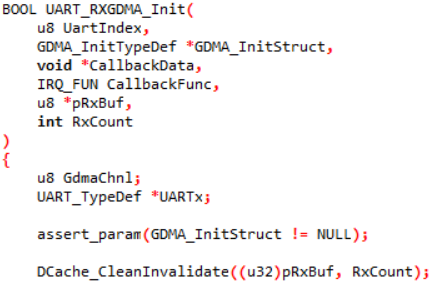

.. _psram:

Introduction
------------------------
Pseudo-Static Random Access Memory (PSRAM) is used for high-speed transmission of the data stream. The |CHIP_NAME| communicates with PSRAM via PSRAM controller (PSRAMC). PSRAM can be accessed by KM4 and KM0, and supports execution on PSRAM.

The features of PSRAM are:

- Clock rate: up to 200MHz

- Double Data Rate (DDR)

- Read-Write Data Strobe (DQS)

- Supports Half sleep and deep power-down mode

- Programmable drive strength

- Temperature Compensated Refresh

- 16/32/64/128 bytes wrap burst access

- Distributed refresh interval varies with temperature

- Address mapping: 0x6000_0000~0x6040_0000

Throughput
--------------------
PSRAM supports direct access and DMA access. The throughput of PSRAM is listed in the following table.
 
.. table:: Throughput of PSRAM (200MHz)
   :width: 100%
   :widths: auto

   +---------------+------------------+-------------------------------+------------------+-------------------------------+
   |               | Writing 32 bytes                                 | Reading 32 bytes                                 |
   | Access mode   +------------------+-------------------------------+------------------+-------------------------------+
   |               | Theory           | Test on the KM4               | Theory           | Test on the KM4               |
   +---------------+------------------+-------------------------------+------------------+-------------------------------+
   | Direct access | 1523.81Mbps      | (32*8)/(199.68ns)=1282.05Mbps | 1454.55Mbps      | (32*8)/(212.16ns)=1204.14Mbps |
   |               |                  |                               |                  |                               |
   | (write back)  |                  |                               |                  |                               |
   +---------------+------------------+-------------------------------+------------------+-------------------------------+
   | DMA access    | 2206.9Mbps       | 1641.03Mbps                   | 2133.33Mbps      | 1172.16Mbps                   |
   +---------------+------------------+-------------------------------+------------------+-------------------------------+

.. note::
      - Throughput theoretical calculation:

         - The test data above takes variable initial latency, so there will be 1 or 2 times initial latency depending on RWDS.

         - The header overlaps with delay by 1T.

         - Since it is DDR PSRAM, 16T is used to transmit 32 bytes.

      - Direct access:

         - By default, we will assign the cache attribute to PSRAM. Therefore, when testing the access performance of PSRAM, we need to consider the cache attribute comprehensively.

         - In the operation of reading 4 bytes, if read hit (that is, the address data is stored in the cache), the CPU directly reads 4bytes from the cache. If read miss (the address data is not in the cache), it needs to read a cache line size data from PSRAM to the cache.

         - In the operation of writing 4 bytes, if write hit (the address data exists in the cache), the content of the address in the cache will be updated, and then a cacheline size will be updated to PSRAM when the cache flush. If write miss ( the address to be written is not in the cache), based on the write allocate policy, the CPU will first read a cacheline size data from PSRAM to the cache, and then update the content in the cache.

         - The read / write throughput data in the table is measured based on read miss / cache flush, which requires access to PSRAM. TP of write allocate is equal to TP of read miss.

         - Instruction execution time also needs to be taken into consideration.

.. table:: PSRAM throughput theoretical calculation
   :width: 100%
   :widths: auto

   +------------------------------------------------------+---------------------------+----------------------------+
   | Item                                                 | Writing 32 bits           | Reading 32 bits            |
   +======================================================+===========================+============================+
   | Header + delay                                       | [3 +22] *4ns = 100ns      | [3 + 23] * 4ns = 104ns     |
   +------------------------------------------------------+---------------------------+----------------------------+
   | Data transmit period                                 | 2 * 4ns =8ns              | 16 * 4ns = 64ns            |
   +------------------------------------------------------+---------------------------+----------------------------+
   | Hardware hold                                        | 1 * 4ns =4ns              | 2 *4ns = 8ns               |
   +------------------------------------------------------+---------------------------+----------------------------+
   | Total without considering instruction execution time | 100ns + 8ns + 4ns = 112ns | 104ns + 64ns + 8ns = 176ns |
   +------------------------------------------------------+---------------------------+----------------------------+
   | Throughput theoretical value                         | 32/112ns = 285.71Mbps     | (32*8)/176ns = 1454.55Mbps |
   +------------------------------------------------------+---------------------------+----------------------------+

Boot from PSRAM
------------------------------
If the PSRAM is embedded in the chip, follow these steps to boot from PSRAM in the SDK.

1. Enable the power supply of PSRAM in the bootloader

2. Initialize the PSRAM controller and PSRAM device to synchronize the relevant parameters

3. Calibrate the PSRAM

.. code-block:: C

   RCC_PeriphClockCmd(APBPeriph_PSRAM, APBPeriph_PSRAM_CLOCK, ENABLE);
   DBG_PRINT(MODULE_BOOT, LEVEL_INFO, "Init PSRAM\r\n");
   BOOT_PSRAM_Init();

PSRAM Cache “Write Back” Policy
--------------------------------------------------------------
When a cache hit occurs on a store access, the data is only written to the cache. Data in the cache can therefore be more up-to-date than data in memory. Any such data is written back to memory when the cache line is cleaned or reallocated. Another common term for a write-back cache is a copy-back cache.

Row Hammer
~~~~~~~~~~~~~~~~~~~~
With the increasing density of DRAM, its memory cells become smaller and smaller, and the stored charge decreases. As a result, the noise tolerance between memory cells is reduced, resulting in the interaction of charges between two independent memory cells. Row hammer is caused by this defect in the design of memory hardware chip. Its principle is to repeatedly read and write the peer address in DRAM memory unit, so that the charge leakage occurs in adjacent rows, and the bit reversal phenomenon occurs in adjacent rows, that is, 0 is reversed to 1, and 1 is reversed to 0.

Therefore, when a large number of accesses are made to PSRAM in a short time, if the refresh frequency is not enough, the MEM space of every 2K (i.e. two rows) will affect each other. When we perform a large number of continuous write operations on a line, the charges of adjacent lines will be affected and the value will change.

Notice
~~~~~~~~~~~~
Cache Operation
^^^^^^^^^^^^^^^^^^^^^^^^^^^^^^
On the “Write Back” policy, the synchronization operations need to be taken between cache and PSRAM to keep content consistency, especially for multiple access by different sources, e.g. CPU, serial ports and peripherals.

As the cache line of KM4/KM0 cache is 32 bytes, and cache operations are all based on the cache line. So the buffer size and buffer starting address are recommended to be 32/64 bytes aligned to avoid synchronization issues.

DMA Operation
^^^^^^^^^^^^^^^^^^^^^^^^^^
The following steps should be added when executing DMA Rx/Tx.

.. table::
   :width: 100%
   :widths: auto

   +-----------+----------------------------------------------------------------------------------------------------------------------------------------------------------------------------------------------------------------------------------------------------+
   | Operation | Step                                                                                                                                                                                                                                               |
   +===========+====================================================================================================================================================================================================================================================+
   | DMA Rx    | 1. Prepare Rx buffer                                                                                                                                                                                                                               |
   |           |                                                                                                                                                                                                                                                    |
   |           | 2. Do ``DCache_CleanInvalidate()`` to avoid cache data write back during DMA Rx                                                                                                                                                                    |
   |           |                                                                                                                                                                                                                                                    |
   |           | 3. Do DMA Rx config                                                                                                                                                                                                                                |
   |           |                                                                                                                                                                                                                                                    |
   |           | 4. Trigger DMA Rx interrupt                                                                                                                                                                                                                        |
   |           |                                                                                                                                                                                                                                                    |
   |           | 5. Do ``DCache_Invalidate()`` in Rx Done Handler to clean the old data                                                                                                                                                                             |
   |           |                                                                                                                                                                                                                                                    |
   |           |    .. note::                                                                                                                                                                                                                                       |                                                                                                    
   |           |                                                                                                                                                                                                                                                    |
   |           |       During GDMA transmission, it is forbidden to write or cache flush DST buffer. (Taking {SDK}/component/example/peripheral/raw/uart/uart_dma_stream/src/main.c for example, uart_recv_string_done is DMA Rx Done Interrupt Handler)            |
   |           |                                                                                                                                                                                                                                                    |
   |           |       .. code-block:: C                                                                                                                                                                                                                            |
   |           |                                                                                                                                                                                                                                                    |
   |           |          u32 uart_recv_string_done(void *data)                                                                                                                                                                                                     |
   |           |          {                                                                                                                                                                                                                                         |
   |           |             UNUSED(data);                                                                                                                                                                                                                          |
   |           |             /* To solve the cache consistency problem, DMA mode needs it */                                                                                                                                                                        |
   |           |             DCache_Invalidate((u32)rx_buf, SRX_BUF_SZ);                                                                                                                                                                                            |
   |           |             dma_free();                                                                                                                                                                                                                            |
   |           |             rx_done = 1;                                                                                                                                                                                                                           |
   |           |             return 0;                                                                                                                                                                                                                              |
   |           |          }                                                                                                                                                                                                                                         |
   |           |                                                                                                                                                                                                                                                    |
   |           | 6. CPU reads Rx Buffer                                                                                                                                                                                                                             |
   +-----------+----------------------------------------------------------------------------------------------------------------------------------------------------------------------------------------------------------------------------------------------------+
   | DMA Tx    | 1. CPU prepares Tx buffer data                                                                                                                                                                                                                     |
   |           |                                                                                                                                                                                                                                                    |
   |           | 2. Do ``DCache_CleanInvalidate()`` for Tx buffer to synchronize the data                                                                                                                                                                           |
   |           |                                                                                                                                                                                                                                                    |
   |           | 3. Do DMA Tx configuration                                                                                                                                                                                                                         |
   |           |                                                                                                                                                                                                                                                    |
   |           | 4. Trigger DMA Tx interrupt                                                                                                                                                                                                                        |
   +-----------+----------------------------------------------------------------------------------------------------------------------------------------------------------------------------------------------------------------------------------------------------+

In SDK, only the example of one-time xxx_GDMA_Init one-time transmission is illustrated. Step 2 is included in ``xxx_GDMA_Init`` by default.

If you need multi-time DMA Tx/Rx with only one-time xxx_GDMA_Init, ``DCache_CleanInvalidate()`` should be called every time before DMA transmission starts.

.. figure:: ../figures/UART_TXGDMA_Init1.png
   :scale: 80%
   :align: center

TCEM Setting
------------------------
The ``TPR0[24:31]`` (CS_TCEM) provides the function that when the CSN low pulse width is equal to `(CS_TCEM * 32)*busclk`, the SPI Flash Controller will automatically chop the current transmission and pull CS up.

Winbond
~~~~~~~~~~~~~~
- When the temperature is less than 85°C, PSRAM refresh the intern cell array using normal rate (4us).

- When the temperature is greater than 85°C and less than 125°C, PSRAM refresh the internal cell array using faster rate (1us). This sets an upper limit on the length of read and write transactions so that the automatic distributed refresh operation can be done between transactions. This limit is called the CS# low maximum time (tCSM) and the tCSM will be equal to the maximum distributed refresh interval.

So when the temperature is less than 85°C, for higher performance, we recommend that ``CS_TCEM`` should be equal to `4us/busclk/32`. When the temperature is greater than 85°C, the value should be equal to `1us/busclk/32`.

APM
~~~~~~
APM is in extended mode by default, so it always keeps fast refresh (1us). Here, ``CS_TCEM`` is recommended equal to `1us/busclk/32`.

