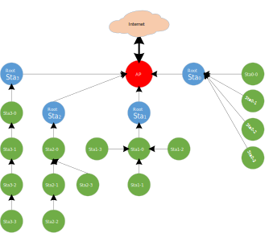
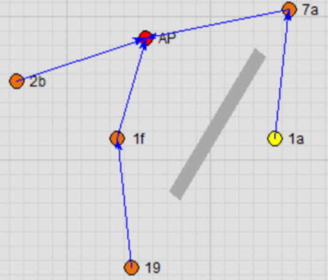

.. _wifi_tunnel:

Wi-Fi Tunnel Topology
------------------------------------------
As shown in the figure below, Wi-Fi Tunnel is a mesh network with tree topology used to extend the transmission distance of Wi-Fi, allowing stations that are relatively far from the AP to maintain a stable online status.

   Wi-Fi Tunnel topology

Wi-Fi Tunnel Advantage
--------------------------------------------
The well-designed Wi-Fi Tunnel has the following advantages:

- A software-unsensible mesh network:

   - Wi-Fi Tunnel is implemented entirely through the Wi-Fi driver. Whether it's a root node or its child node, each node regards itself as a regular station connected to the AP.

   - It is no need to upgrade configuration programs or connection programs, and each node can be configured and connected as a regular station.

   - The application development of each station has no difference with that of a regular station, and the application does not need to be concerned with routing information.

- Rapid networking:

   - With an optimized algorithm, nodes can quickly form a mesh network.

   - In the event of a parent node fault (power down or crash), child nodes can quickly switch to a new parent node with nearly no impact on their data communication.

   - Child nodes can also quickly switch to an appropriate parent node as a group, without each child node switching individually.

- High througput for child nodes:

   - Data forwarding is directly implemented through the Wi-Fi driver, utilizing less RAM and CPU resources.

   - Compared to a traditional mesh network, Wi-Fi Tunnel requires minimal software processing, so even nodes several hops away can achieve a good throughput.

- Network stability:

   - Due to minimal software processing and the upper layer not needing to be concerned with routing, the entire mesh network is highly stable.

   - Common mesh network issues like loops do not occur.

Wi-Fi Tunnel Data Flow
--------------------------------------------
In traditional mesh network, data forwarding typically passes through the application or TCP/IP stack.
In contrast, Wi-Fi Tunnel handles data forwarding directly via the Wi-Fi driver, requiring minimal software-processing flow, which can significantly save computing power and RAM resources.

As a result of minimal software-processing flow, the software-processing time is also greatly reduced. Consequently, even nodes several hops away communicating with the AP can achieve good throughput.

+------------------------------------------------------+-------------------------------------------------+
| .. image:: ../figures/wifi_traditional_data_flow.svg | .. image:: ../figures/wifi_tunnel_data_flow.svg |
|    :width: 450px                                     |    :width: 450px                                |
+------------------------------------------------------+-------------------------------------------------+
| Wi-Fi traditional data flow                          | Wi-Fi Tunnel data flow                          |
+------------------------------------------------------+-------------------------------------------------+

Wi-Fi Tunnel Capacity
------------------------------------------
Wi-Fi Tunnel capacity refers to the number of child nodes that each root node connected to the AP can accommodate. Note that it is the total number of child nodes across all layers, regardless of the number of the layer.

The diagram below illustrates an example where the capacity is 4.

- Topology 0: All four nodes are directly connected to the root node

- Topology 3: The four nodes form a 4-hop network

- Can also be any intermediate topology between Topology 0 and Topology 3

   Wi-Fi Tunnel capacity

Wi-Fi Tunnel Throughput (TBD)
------------------------------------------------------
.. table::
   :width: 100%
   :widths: auto

   +----------------+--------+--------+--------+--------+
   | Station        | UDP Tx | UDP Rx | TCP Tx | TCP Rx |
   +================+========+========+========+========+
   | Root Station   |        |        |        |        |
   +----------------+--------+--------+--------+--------+
   | Layer1 Station |        |        |        |        |
   +----------------+--------+--------+--------+--------+
   | Layer2 Station |        |        |        |        |
   +----------------+--------+--------+--------+--------+
   | Layer3 Station |        |        |        |        |
   +----------------+--------+--------+--------+--------+
   | Layer4 Station |        |        |        |        |
   +----------------+--------+--------+--------+--------+

Wi-Fi Tunnel Demo Tool
--------------------------------------------
Introduction
~~~~~~~~~~~~~~~~~~~~~~~~
To effectively test and demonstrate Wi-Fi Tunnel, we have specifically developed a software tool.

   Wi-Fi Tunnel demo tool

The main features of this tool are as follows:

- Users can freely drag each node's position, and the program can change the signal attenuation between nodes based on their relative distance (with an adjustable scale) to simulate the real-world relationship between distance and signal attenuation.
- When the signal strength between a child node and its parent node does not meet the conditions for efficient communication, the node can quickly switch the topology relationship.

- Users can forcely delete a node (the node will be reset), simulating node fault to test the switching efficiency of its child nodes.

- Users can also add walls in the UI to simulate signal attenuation in real-world application scenarios.

User Guide (TBD)
~~~~~~~~~~~~~~~~~~~~~~~~~~~~~~~~

